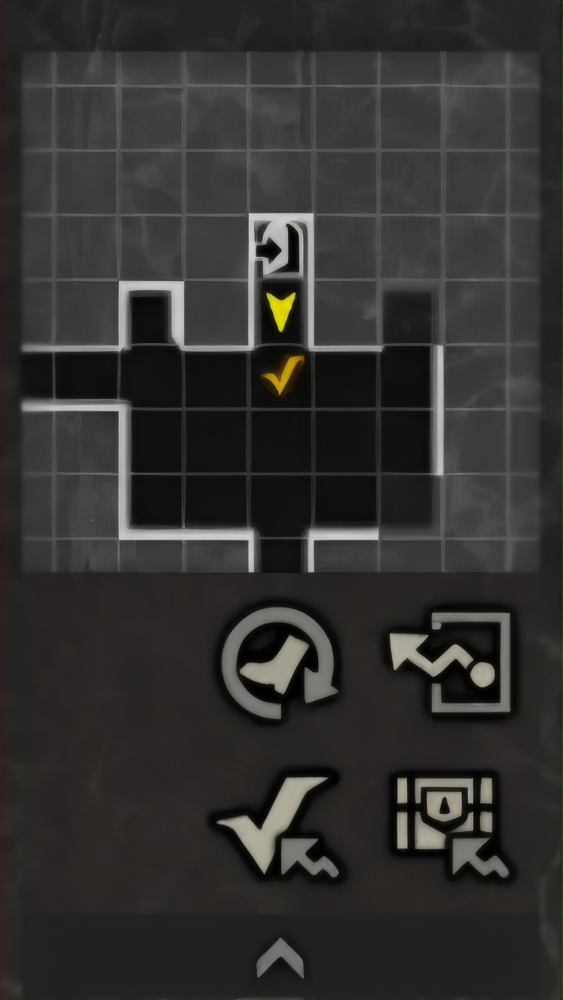

# Wizardry Daphne Kor Macro (위저드리 다프네 한글판 매크로)

> **WizDapKor_v1.19.1 안내**
> - **재부팅 로그 파일명 결함 완치**: 에뮬레이터 콜드 리부트가 연속으로 여러 번 일어나도 로그 파일명이
>   항상 "reboot1" 아니면 "start"로만 찍히던 결함을 완치했습니다 - 이제 자동 재시작이 누적되면
>   "reboot2", "reboot3"...처럼 정확히 표시됩니다. 아울러 수동/원격으로 매크로를 새로 시작하면 항상
>   "start"로 찍히도록(예전 리부트 이력이 남아있어도) `.bat` 파일에서 카운터를 초기화하게 했습니다.
> - **유령성 4층 착지 스턱 추가 단축**: 4층→3층 착지 직후 스턱 감지 시 정체 사다리 1~2단계(범용 완충
>   연타)를 건너뛰고 1회차부터 곧바로 전진 스와이프+출구 재탭을 실행하도록 개선(실전 로그로 "1회차
>   정체 = 예외 없이 항상 진짜 스턱"임이 반복 확인됨). "재개 오진 방지" 재확인 경로의 중복 스크린샷과
>   FIELD_WAIT 재진입 시 불필요한 4초 대기도 제거해 체감 지연이 절반으로 줄었습니다.
>
> <details>
> <summary>이전 버전(1.17.1~1.19.0) 변경 이력 보기</summary>
>
> - **(1.19.0) MuMu 멀티 인스턴스(0/1/2번) 자동 감지**: 에뮬레이터 강제 재부팅 시 어떤 뮤뮤 인스턴스를
>   다시 켜야 할지 마지막 접속 포트 기준으로 자동 판단합니다. 재부팅 시 뮤뮤 설정 파일이 프로젝트
>   폴더에 잘못 생성되던 결함도 함께 완치했습니다.
> - **(1.19.0) 원격 정지 시 콘솔창 종료 결함 재완치**: 1.18.0에서 넣은 기능이 매크로 자가 재시작
>   이후엔 다시 무력화되던 구조적 결함(재시작을 거치면 부모 프로세스 추적이 끊김)을 완치했습니다.
> - **(1.19.0) 유령성 4층 상자먹튀파밍 나가기 안정화**: "상자 없음" 토스트를 "경로 없음"으로 오인해
>   불필요한 복구 동작이 나가던 결함을 완치했습니다(착지 스턱 지연 단축은 1.19.1에서 완성).
> - **(1.19.0) 재시작 정책 조정**: 가로화면 인식 실패 시 앱 재시작으로 넘어가는 기준을 30회에서 3회로
>   단축해 과잉 대기 시간을 줄였습니다.
> - 아직 남아있는 알려진 버그(가끔 4층→3층 나가기 대신 3층 상자를 훑고 오는 경우, 톤베리 조우 시
>   자동전투가 그냥 닥돌하는 문제)는 아래 "3. 프리셋 설정"의 상자먹튀파밍 TIP을 참고해주세요.
> - **(1.18.0) 유령성 4층 "상자먹튀파밍" 신규 지원**: 3층에서 하켄으로 진입한 뒤 자동으로 4층까지 들어가
>   상자를 먹고 빠지는 신규 던전 주회가 추가됐습니다.
> - **(1.18.0) 프리셋 선택 방식 변경**: 던전 선택을 `main.py` 편집이 아니라 프로젝트 루트의 던전별
>   `.bat` 파일(`백아1층 파밍.bat`/`유령성2층 채굴.bat`/`유령성4층 상자파밍.bat`) 실행으로 전환.
> - **(1.18.0) 원격 정지 시 콘솔창까지 함께 종료**: 대시보드에서 매크로를 정지하면 이를 띄운 검은
>   콘솔창도 같이 닫히도록 개선(1.19.0에서 재시작 후에도 유지되도록 재완치).
> - **(1.18.0) 던전 필드 정지 시간 단축**: 상자 이동 버튼 더블탭을 단일탭으로 줄이고, 힐/전투/상자 처리
>   직후엔 "재개" 버튼으로 중단된 이동을 즉시 이어가도록 개선.
> - **(1.18.0) 오탐/오작동 다수 완치**: 나가기 도중 하켄 메뉴 미처리, 전투 인식 이진화 불일치로 인한
>   헛도는 재부팅, 정비 후 엉뚱한 버튼 재탭, 전투/상자 카운트 집계 지연으로 힐링이 뜬금없이 발동하던
>   결함 등을 완치.
> - **파이널 판타지 11 콜라보 던전 "북쪽의 유령선" 지원**: 광석 채굴(파밍) 전용 주회 로직이 새로 탑재되어, 상자파밍(백아)과 완전히 다른 회군 규칙(곡괭이 소진 시에만 마을 복귀, 그 외엔 무한 재진입)으로 동작합니다.
> - **원격 시작/정지 지원 (선택 사항)**: 테일스케일 기반의 초경량 원격 제어 서버(`remote_control/`)가 추가되어, 폰 브라우저에서 실시간 로그를 보며 버튼으로 매크로를 시작/정지할 수 있습니다. 설정하지 않으면 비활성 상태로 남는 완전 선택적 기능입니다. 자세한 내용은 아래 "6. 원격 시작/정지" 항목 참고.
> - **(hotfix1) 갱신/공지 팝업 대응 강화**: "타이틀로" 팝업이 마을로 오판정되던 결함과 재시도 팝업 누락을 완치, 해당 팝업 감지 시 매크로를 안전하게 완전 재시작하도록 개선.
> - **(hotfix2) 원격 제어 대시보드 신설**: 시작/정지/상태확인 개별 URL 대신, 실시간 로그와 버튼이 함께 있는 대시보드 웹페이지 하나로 통합. 원격으로 마지막에 시작한 프리셋도 자동으로 기억합니다.
> - **(hotfix3) 원격 제어 백그라운드 실행 지원**: 콘솔 창을 실수로 닫아도 원격 제어가 꺼지지 않도록, 창 없이 백그라운드로 돌아가는 시작/종료 배치파일을 추가했습니다. 대시보드 URL 표시/폴링 관련 결함도 함께 완치했습니다.
> - **(hotfix4) 하켄의 가호 대응 신설**: 하루 한 번(자정 이후) 하켄 귀환 시 뜨는 가호 선택 팝업을 인식하지 못해 매크로가 멈추던 문제를 완치했습니다. 3개 선택지의 등급을 자동으로 비교해 가장 좋은 가호를 선택합니다.
> - **(hotfix5) 하켄의 가호 오탐지 완치**: 하켄 구역 이동 목록 화면을 가호 팝업으로 잘못 인식해 엉뚱한 구역으로 텔레포트하던 결함을 실전 로그로 확인하고 완치했습니다.
> - **(hotfix6) 뮤뮤 완전 동결 시 자가복구 결함 완치**: 뮤뮤가 완전히 멈췄을 때 자가복구 로직 자체가 같이 멈춰버려 매크로가 몇 시간씩 방치되던 문제를 완치했습니다. 이어서 발견된 동결감지 오탐(귀환 직후 잘못된 재시작 폭증), 증거 스크린샷이 빈 이미지로 저장되던 결함, 하켄 앵커 판정 로직까지 함께 개선했습니다.
> - **(hotfix7) 재시작/하켄탈출 복구 결함 완치**: 뮤뮤가 완전히 먹통일 때 재시작 시도 자체가 멈추면 연속 재시작 카운터가 기록되지 않아 에뮬레이터 강제 재부팅으로 승격이 안 되던 결함을 완치했습니다. 하켄 메뉴가 안 열리는 상황에도 계단 탈출과 동일한 백스텝 복구 및 자체 워치독을 적용해 무한 대기 없이 빠르게 자가 복구하도록 개선했습니다.
> - **(hotfix8) 피장막 대응 및 하켄 가호 우선순위 개선**: 주인공이 빈사가 되어 화면에 붉은 피안개가 씌워져도 상자/필드 인식이 계속되도록 완치하고, 빈사 상태를 감지하면 자동으로 힐 시퀀스를 격발하도록 개선했습니다. 하켄 메뉴가 떠 있는 화면에서 매크로를 시작해도 즉시 인식하도록 완치했습니다. 유령성 하켄의 가호에서 "데몬족 헌터"/"오드의 가호"를 색상 등급보다 우선해서 선택하도록 개선했습니다.
> - **(hotfix9) 대용량 다운로드/무한 정체/하켄 기동 인식 결함 완치**: 목요일 콘텐츠 추가 점검 후 대용량(기가바이트급) 리소스 다운로드 도중 기동 복구가 타임아웃되어 에뮬레이터가 강제 리부트되던 결함을 완치했습니다(다운로드 확인 후 20분 유예). 뮤뮤가 완전히 멈춰도 정체 복구 시도 자체가 타이머를 계속 리셋해버려 5분 하드 리밋이 영원히 발동하지 않던 구조적 결함을 완치했습니다. 하켄 메뉴가 떠 있는 화면에서 매크로를 재시작해도 즉시 인식하고 귀환하도록 완치했습니다.
> - **(hotfix10) 유령성 던전선택 버튼 미인식 완치**: 유령성 3회차 엔딩(진엔딩) 이후 던전선택 화면 배경이 바뀌면서 층 이동 버튼 인식이 밤새 실패하던 결함을 완치했습니다(여러 이진화 문턱을 순차 시도하는 방식으로 개선).
>
> </details>

모바일게임 위저드리 배리언트 다프네의 오토파밍 매크로입니다. 현재 백아1층 상자파밍, 유령성 2층 광석파밍,
유령성 4층 상자먹튀파밍 세 가지 던전 주회를 구현해두었습니다.

📝 더 자세한 소개와 사용기는 [블로그 글](https://blog.naver.com/freeman_life/224371225887)에서 확인하실 수 있습니다.

---

## 🌟 핵심 기능
1. **프리셋 기반 자동 던전 주회 및 회군**: 선택한 프리셋에 따라 자동으로 던전을 순회하고, 조건 충족 시 마을로 복귀하여 여관 숙박 정비(레벨업/부활/체력 회복)를 수행합니다.
   - **백아1층 상자파밍**: 지정된 횟수(`LIMIT_DUNGEON_LOOPS`, `0`이면 무한)만큼 주회 후 마을 회군.
   - **유령성2층 광석채굴**: 주회 횟수와 무관하게, 곡괭이가 소진될 때만 마을로 회군하고 그 외엔 무한 재진입.
2. **전투/상자개봉 후 자동정비**: 지정된 전투 횟수 누적 시 혹은 상자 개봉 정산 종료 직후, 자동으로 힐러를 소환해 파티 치료를 수행합니다.
3. **상자 조우 시 자동 해제**: 던전 주회 중 상자를 만나면 자동으로 감지해 해제 버튼을 연타하는 방식이라, 따개 캐릭터의 함정해제 스펙이 충분해야 안정적으로 해제됩니다.
4. **2중 자가 복구 가드 (Self-Healing)**:
   - 앱/에뮬레이터 프리징 시 프로세스를 강제 종료하고 콜드 리부트(Cold Boot)를 수행합니다.
   - 재기동 시 인게임 점검, 다운로드, 네트워크 오류, 주의 경고창, 기동 공지 팝업, 가로 화면 이상 상태를 무인으로 자동 돌파하여 다시 정상 순회로 이행합니다.

> [!WARNING]
> **현재 지원 범위**
> - 현재 정식 지원 던전 주회는 세 가지입니다: **"백아의 동굴"(상자파밍)**, **"북쪽의 유령선" 2층(광석파밍)**,
>   **"북쪽의 유령선" 4층(상자먹튀파밍, FF XI 콜라보 이벤트 던전)**.
> - 전투 중 아군이 사망하면 **역행의 오른손**을 자동으로 연타하고, 주인공이 사망하면 **부활의 불꽃**을 자동으로 사용합니다. 다만 아군이 2인 이상 동시에 사망했을 때 뜨는 선택지 처리는 아직 반영하지 못했습니다. :)
> - **유령성 4층 상자먹튀파밍은 아직 자잘한 버그가 남아있는 상태로 우선 배포합니다.** 그래도 에러 로그가
>   찍히는 것과 무관하게 상자파밍 자체는 계속 이어지니, 로그에 경고/에러가 좀 섞여 나와도 실제로 계속
>   상자를 먹고 있다면 그냥 쓰셔도 무방합니다. 완전히 멈추거나 엉뚱한 곳에서 반복 정체될 때만 로그를
>   첨부해서 문의해주세요.

---

## ⚙️ 1. 에뮬레이터 (MuMu Player) 및 게임 내 설정

> [!IMPORTANT]
> **MuMu Player의 기본 표준 세팅을 변경 없이 그대로 유지해야 합니다.**
> - 매크로의 이미지 템플릿 및 ROI 박스 검출 기준은 **MuMu Player 12의 기본 표준 해상도인 `2560 x 1440` (360 DPI)**을 기준으로 제작되었습니다.
> - 해상도를 임의로 변경할 경우 이미지 매칭 스캔 영역이 찌그러지거나 좌표가 왜곡되어 오탐/오클릭을 격발하게 됩니다.
> - 그래픽 렌더러는 **DirectX** 권장 (Vulkan은 그래픽 드라이버/카드 조합에 따라 렌더링 크래시 위험이 상대적으로 높습니다).

### 에뮬레이터 설정
* **디버그 모드 (ADB) 활성화**:
  - MuMu 플레이어 설정에서 디버깅 모드(ADB)를 항상 허용으로 설정해 주셔야 파이썬이 통신할 수 있습니다.
  - 기본 접속 포트는 통상 `16384` (MuMu 12 기본값)이며, 스크립트 실행 시 3중 포트 자동 스위칭 레이더가 활성화되어 연결을 수립합니다.

### 위저드리 다프네 게임 내 설정
1. **미니맵 배율 기본값 고수**:
   - 던전 내 미니맵과 화면 상태는 반드시 **게임 초기 상태(기본 줌 세팅)** 그대로 유지해야 합니다.
   - 사용자가 인위적으로 미니맵을 줌인(확대) 또는 줌아웃(축소)한 상태일 경우, 맵의 크기나 비율이 달라져 매크로의 이동 제어 및 매칭 엔진이 정상 작동하지 않습니다.
2. **인게임 [설정] (톱니바퀴) 권장 세팅**:
   | 설정 항목 | 권장 세팅값 | 비고 |
   | :--- | :--- | :--- |
   | **화질 설정** | `속도우선` | 프레임 드롭에 의한 탭 씹힘 방지 |
   | **프레임 제한** | `30fps` | CPU 리소스 절약 및 안정적 매칭 |
   | **자동선택** | `OFF` | 대열 꼬임 예방 |
   | **텍스트 일괄 표시** | `ON` | 대화창 연타 돌파 속도 극대화 |
   | **밝기 설정** | `최소` | 이미지 템플릿 색감 매칭의 무결함 유지 |

---

## 💻 2. 파이썬 환경 구축 및 필수 라이브러리 설치

### 파이썬 설치
- Python 3.10 버전 이상의 윈도우용 파이썬을 설치합니다.
- 설치 시 반드시 **[Add python.exe to PATH]** 옵션을 체크하여 환경 변수에 등록해 주세요.

### 필수 라이브러리 설치
윈도우 명령 프롬프트(cmd) 또는 PowerShell을 열고 아래 명령어를 입력하여 필요한 라이브러리를 설치합니다.
```bash
pip install opencv-python pillow numpy pure-python-adb
```

---

## 🎯 3. 프리셋 설정

> [!IMPORTANT]
> **신버전부터: 던전 선택은 `main.py`를 편집하는 게 아니라, 프로젝트 루트의 `.bat` 파일 중 원하는 걸
> 실행하는 것으로 합니다.** `src/main.py`는 이제 (모든 던전에 공통으로 적용되는) **글로벌 설정값만
> 편집하는 곳**이고, `ACTIVE_PRESET_NAME`을 직접 고치거나 프리셋 줄을 손으로 전환하는 건 더 이상
> 권장하지 않습니다.

던전마다 필요한 마을/층/파밍방식 조합은 이미 다 세팅되어 있고, 프로젝트 루트에 던전별 배치파일이 하나씩 있습니다:

| 배치파일 | 던전 주회 |
| :--- | :--- |
| `백아1층 파밍.bat` | 백아의 동굴 1층 (상자파밍) |
| `유령성2층 채굴.bat` | 북쪽의 유령선 2층 (광석파밍) |
| `유령성4층 상자파밍.bat` | 북쪽의 유령선 4층 (상자먹튀파밍) |

원하는 던전의 배치파일을 더블클릭하면 그 프리셋으로 바로 시작됩니다(원격 대시보드에서도 동일하게 선택 가능 - 아래 "6. 원격 시작/정지" 참고). 새로운 던전 조합이 필요하시면 `src/presets.json`에 프리셋을 추가할 수 있지만, 해당 마을/던전에 대한 이미지 템플릿과 코드 연동이 먼저 되어 있어야 하니 AI 코딩 어시스턴트에게 요청하시는 걸 권장합니다.

> [!TIP]
> **광석파밍("유령성 2층 채굴") 실전 팁**
> - **(필수) 2층/4층/5층 각각, 하켄 바로 앞에 있는 채굴 장소에 체크포인트를 미리 찍어두셔야 합니다.** 체크포인트가 없으면 매크로의 하켄 귀환/재진입 루프가 정상 작동하지 않습니다.
> - **마을이 아니라 던전선택 화면에서 매크로를 시작하는 것을 권장합니다.** 곡괭이를 인벤토리에 충분히 채워둔 뒤 유령성 던전선택 화면에서 시작해 주세요. 마을에서 시작하면 매크로가 곧바로 여관 숙박부터 진행하는데, 이 과정의 "소지품 정리" 단계에서 인벤토리의 황금 곡괭이가 창고로 들어가버릴 수 있습니다.
> - **노던할로우 마을**의 "소지품 정리" 옵션에서 **북방의 곡괭이 자동 채우기**를 설정해두면, 들고 있던 곡괭이를 전부 소진했을 때 자동으로 북방의 곡괭이로 채굴을 이어갑니다. 다만 창고에 북방의 곡괭이가 없을 때 자동으로 상점에서 구매가 안 되는 버그가 있으니, 미리 창고에 충분한 양의 북방의 곡괭이를 구매해두시는 걸 추천드립니다. (수정 공지는 올라왔지만 직접 확인은 못 해봤습니다.)

> [!TIP]
> **상자먹튀파밍("유령성 4층 상자파밍") 실전 팁**
> - 이 프리셋은 **3층에서 하켄으로 진입한 뒤, 체크포인트 이동과 스와이프 조작으로 자동으로 4층까지
>   들어가는 구조**입니다 - 던전선택 화면에서 4층 버튼을 직접 누르는 게 아니라, 3층 진입 후 매크로가
>   알아서 4층으로 넘어갑니다.
> - **(필수) 게임 내부 버그로 인해 3층에서 4층 입구까지 한 번에 자동이동이 안 됩니다.** 그래서 4층
>   입구에서 **아래로 두 칸 떨어진 자리**(입구 바로 아래 칸이 아니라, 그 아래 한 칸 더)에 미리
>   체크포인트를 찍어두셔야 합니다. 아래 스크린샷(`유령성3층셋팅.png`, 배치파일과 같은 폴더)을 참고해
>   동일한 위치에 체크포인트를 찍어주세요.
>
>   
> - **던전 안(3층 필드 등)에서 매크로를 시작하지 마시고, 될 수 있으면 유령성 던전선택 화면에서
>   시작해주세요.** 던전 안에서 시작하면 위 3층→4층 진입 시퀀스를 거치지 않고 곧바로 그 자리에서
>   상자파밍부터 시작해버립니다.
> - **⚠️ 톤베리 조우 시 사망 각오하고 사용하세요.** 아직 몹별 캐릭터 스킬 자동 사용(톤베리 대응 포함)이
>   구현되어 있지 않아, 톤베리를 만나면 자동전투가 회피/원거리 유지 없이 그냥 닥돌(근접 돌진)해버려
>   파티원이 사망할 수 있습니다(제보: 실제로 밤새 돌려보니 일부 캐릭터 멘탈이 박살나 있었음). 소중한
>   캐릭터라면 이 프리셋 사용을 신중히 결정해주세요. (여담: 제작자는 전사 라인 캐릭터에도 그냥
>   에클라 보우를 들려서 원거리로 돌려버려서 이 문제를 딱히 안 느끼고 있어, 스킬 자동화 개발 우선순위가
>   낮은 상태입니다 ㅋㅋㅋ)
> - **⚠️ 가끔 나가기가 삑나서, 4층 상자를 다 털고 3층으로 내려온 뒤 던전 밖으로 안 나가고 3층 상자를
>   또 훑고 오는 경우가 있습니다.** 원인 미확정인 알려진 버그입니다. 위험하진 않고(그냥 3층 상자도
>   먹고 옴) 파밍 시간만 조금 늘어나는 정도이니, 참고만 해주세요.
> - 아직 자잘한 버그가 남아있는 초기 배포 버전입니다 - 로그에 경고/에러가 섞여 나와도 실제로 상자를
>   계속 먹고 있다면 그냥 쓰셔도 됩니다.

---

## 🛠️ 4. `main.py` 사용자 환경 변수 커스텀 설정

`src/main.py` 최상단 **[글로벌 제어 세팅 변수 구역]**의 설정들을 본인의 계정 환경에 맞춰 변경해 사용할 수 있습니다. 이 구역은 **어떤 던전 프리셋을 쓰든 공통으로 적용되는 값**만 모아둔 곳이고, 던전 자체를 바꾸는 건 여기가 아니라 위 "3. 프리셋 설정"에 안내된 `.bat` 파일 선택으로 합니다.

| 변수명 | 기본값 | 상세 설명 |
| :--- | :---: | :--- |
| **`LIMIT_DUNGEON_LOOPS`** | `2` | 상자파밍 전용: 던전을 몇 바퀴 주회하고 마을(여관)로 회군할지 설정합니다. `0`이면 무한 주회. (광석파밍은 이 값과 무관하게 곡괭이 소진 시에만 회군) |
| **`START_RUN_COUNT_OFFSET`** | `1` | 최초 실행 시 시작할 오프셋 카운트입니다. |
| **`ENABLE_FIRST_COMBAT_SKILL`** | `0` | 첫 전투 시 숏컷 기반 광역 스킬 예약을 사용할지 설정합니다. (⚠️ 현재 미구현으로 무조건 `0` 고정) |
| **`ENABLE_HEAL_AFTER_CHEST`** | `0` | 상자 개방 성공 후 긴급 파티 치료(정비)를 작동할지 설정합니다. (`0`: Off / `1`: On) |
| **`HEALING_LOOPS`** | `1` | 몇 회의 전투마다 파티 힐링 정비를 수행할지 설정합니다.<br>- `1`: 매 전투 종료 시 필드 복귀 직후 즉시 힐링 실행<br>- `2`: 2회 전투 치를 때마다 힐링 실행<br>- `0`: 자동 힐링 정비 비활성화 |
| **`HEALER_SLOT`** | `5` | 1번~6번 슬롯 중 주 힐러(스켈톤 등)의 배치 슬롯 번호입니다. |
| **`MASKED_ADVENTURER_SLOT`** | `6` | 1번~6번 슬롯 중 주인공 캐릭터의 배치 슬롯 번호입니다. |
| **`CHEST_OPENER_SLOT`** | `6` | 1번~6번 슬롯 중 상자 따기(함정 해제)를 담당할 캐릭터 슬롯 번호입니다. |
| **`ENABLE_EMULATOR_REBOOT`** | `True` | 디바이스 오프라인 또는 정체 지속 시 에뮬레이터를 강제 재시작할지 설정합니다. |
| **`MUMU_EXECUTABLE_PATH`** | *(경로)* | 에뮬레이터 자동 재부팅을 위해 본인 PC 환경에 맞는 MuMu Player의 실행 파일(`nx_main\MuMuNxMain.exe`) 절대 경로를 입력합니다. |
| **`MUMU_VM_INDEX`** | `"0"` | 아직 ADB 연결에 한 번도 성공하지 못한 상태(예: 최초 부팅 직후 바로 콜드 리부트)에서만 쓰이는 비상용 폴백입니다. 평소엔 마지막으로 실제 연결됐던 포트를 보고 MuMu 인스턴스 번호(0/1/2)를 자동으로 판별하므로, 직접 수정할 필요가 거의 없습니다. |

> [!NOTE]
> `ACTIVE_PRESET_NAME`/`TOWN_NAME`/`DUNGEON_NAME`/`DUNGEON_FLOOR_NAME`/`FARMING_METHOD`도 코드에 보이지만, 이는 **`.bat` 파일 없이 `python src/main.py`를 직접 실행할 때만 쓰이는 비상용 로컬 폴백**이라 직접 수정할 필요가 없습니다. 던전 선택은 항상 위 "3. 프리셋 설정"에 안내된 `.bat` 파일로 하세요.

> [!NOTE]
> **MuMu 멀티 인스턴스 자동 감지 관련 안내**: 콜드 리부트(에뮬레이터 완전 재시작) 시 MuMu의 어느
> 인스턴스(#0/#1/#2)를 켤지는 이제 자동으로 판별합니다. 다만 **#0과 #2 인스턴스의 실제 포트만 직접
> 확인했고, #1은 확인하지 못했습니다**(공식으로 역산한 추정값만 코드에 들어있습니다). **혹시 MuMu에서
> #1 인스턴스를 사용 중이신 분은, 콜드 리부트가 정상적으로 #1을 재실행하는지 한 번 확인해보시고 결과를
> 알려주시면 감사하겠습니다.** (제보는 [블로그](https://blog.naver.com/freeman_life/224371225887) 댓글로 남겨주세요.)

---

## 🚀 5. 매크로 실행 및 관리

### 실행 방법
1. 위 "3. 프리셋 설정"의 표에서 원하는 던전에 해당하는 `.bat` 파일을 확인합니다.
2. 프리셋에 맞춰 게임을 아래 상태로 미리 세팅해두고 매크로를 시작하는 것을 권장합니다. (MuMu가 꺼져 있어도 매크로가 자동으로 실행하고 로그인까지 복구를 시도하지만, 아래 상태에서 시작해야 파밍이 바로 정상 진행됩니다.)
   - **상자파밍(백아 등)**: 미리 쓰고 싶은 스킬을 다 사용해두고 자동전투 모드만 켠 채로, 전투 가능한 상태에서 시작하세요.
   - **광석파밍(유령성 2층 등)**: 곡괭이를 인벤토리에 충분히 채워두고, 마을이 아니라 유령성 던전선택 화면에서 시작하세요. (이유는 위 "광석파밍 실전 팁" 참고)
   - **상자먹튀파밍(유령성 4층)**: 3층 진입 지점부터 시작하세요. 체크포인트를 미리 찍어두셔야 합니다(위 "상자먹튀파밍 실전 팁" 참고).
3. 해당 `.bat` 파일(예: `유령성2층 채굴.bat`)을 더블클릭하면 자동으로 에뮬레이터를 찾아 통신을 연결하고 주행을 개시합니다.

### 로그 관리
* **자동 디스크 청소기**:
  - 매크로를 실행하면 `logs/` 디렉토리에 실행 이력에 대한 상세 텍스트 로그 파일이 생성되고 백업됩니다.
  - 디스크 공간 절약을 위해 매크로 기동 시 **4일이 경과한 오래된 로그 및 이미지 파일들은 자동으로 영구 삭제** 처리됩니다.

### 에러 발생 시 대처법
- 매크로 오작동 또는 에러가 발생하여 멈추는 경우, 에러가 발생한 당시의 에뮬레이터 화면을 캡처하고, `logs` 폴더의 최신 로그 텍스트 파일 내용을 함께 첨부하여 AI 코딩 어시스턴트(Claude Code 등)에 문의하시면 개인 환경에 맞게 수정을 지원받으실 수 있습니다.
- 버그 제보나 문의는 [블로그](https://blog.naver.com/freeman_life/224371225887) 댓글로 남겨주셔도 됩니다.

---

## 📱 6. 원격 시작/정지 (선택 사항)

`remote_control/` 폴더는 폰 브라우저 북마크(홈 화면 아이콘) 탭 한 번으로 PC의 매크로를 원격으로 시작/정지할 수 있게 해주는 **완전히 선택적인 보조 도구**입니다.

### 왜 이 기능을 만들었나
매크로가 던전을 도는 중에 같은 게임 계정으로 폰에서 접속하면, MuMu 쪽 위저드리 세션이 "다른 곳에서 로그인됨"으로 강제 종료됩니다. 그런데 매크로는 이 상황을 "게임이 튕겼다"로 인식하고 **자동으로 재접속을 시도**하는데, 이게 다시 폰 쪽 세션을 끊어버립니다. 결과적으로 폰 접속 ↔ 매크로 자동 재접속이 서로 계속 끊어먹는 악순환이 발생합니다.

그래서 만든 개인적인 용도의 기능입니다: **외출 중 폰으로 직접 플레이하고 싶을 때 → 원격으로 매크로를 잠깐 정지 → 폰으로 즐기기 → 다 끝나면 다시 원격으로 매크로 시작.**

### 보안 관련 안내
- **개발자(저)가 사용자 PC에 접속하는 기능이 전혀 아닙니다.** 이 폴더는 PC 안에서만 동작하는 로컬 서버 스크립트이고, 개발자 서버로 어떤 데이터도 전송되지 않습니다.
- 사용자의 개인정보(계정, 위치, 사용 기록 등)를 수집하거나 활용하는 코드는 전혀 없습니다.
- **직접 설정(테일스케일 설치 + `Start Remote Control.bat` 실행 + 배치파일 경로 입력)하지 않으면 이 기능 자체가 활성화되지 않습니다.** 아무 설정도 안 하면 그냥 없는 기능이나 마찬가지입니다.
- 찜찜하시면 `remote_control/` 폴더를 통째로 지우셔도 됩니다. **매크로 본체(`src/main.py`)는 이 폴더의 존재 여부와 무관하게 정상 동작합니다.**

### 설정 방법
1. PC와 폰에 [Tailscale](https://tailscale.com) 설치 후 같은 계정으로 로그인 (사설 네트워크로 폰-PC를 안전하게 연결, 포트를 인터넷에 노출하지 않습니다).
2. `remote_control/Start Remote Control.bat`를 더블클릭합니다. 프로젝트 루트 폴더에 있는 `.bat` 파일들(예: `유령성2층 채굴.bat`)을 자동으로 찾아 시작 대상으로 등록하므로, 별도 설정 파일을 편집할 필요가 없습니다.
3. 콘솔 화면(그리고 `remote_control/설정안내.txt`)에 **대시보드 URL**이 출력됩니다. (프리셋별로 배치파일을 여러 개 만들어두시면, 대시보드의 시작 드롭다운에 그만큼 자동으로 선택지가 늘어납니다.)
4. 스마트폰의 웹 브라우저에서 그 대시보드 URL을 열고 **"홈 화면에 추가"**로 등록하면, 이후로는 아이콘 탭 한 번으로 원격 제어가 가능합니다.
5. 정상 접속까지 확인되셨다면, 그 다음부터는 `Start Remote Control.bat` 대신 **`Start Remote Control (Background).bat`**를 사용하시는 걸 권장합니다. 창이 아예 뜨지 않고 조용히 백그라운드에서 돌아가기 때문에, 실수로 콘솔 창을 닫아서 원격 제어가 꺼지는 사고를 방지할 수 있습니다. 끌 때는 `Stop Remote Control (Background).bat`를 실행하시면 됩니다.

> [!TIP]
> 처음 설정하실 때는 URL을 눈으로 확인해야 하니 **일반 버전(`Start Remote Control.bat`)으로 먼저 시작**해서 북마크까지 등록하시고, 그 다음부터 평소에는 **백그라운드 버전**을 쓰시는 순서를 권장합니다.

### 대시보드 화면
북마크를 열면 실시간 로그(5초마다 자동 갱신, 화면을 벗어나면 자동 일시정지)와 상태 표시가 상단에 보이고, 그 아래 프리셋 드롭다운 + 시작/정지 버튼이 있습니다. 별도로 "상태확인" 버튼을 누를 필요 없이, 로그가 갱신되는 것 자체로 매크로가 살아있는지 바로 알 수 있습니다.

프리셋별로 배치파일을 여러 개 등록해두신 경우, **드롭다운은 원격으로 마지막에 실제로 시작했던 배치를 기억해서 자동으로 미리 선택해둡니다** (예: 지난번에 원격으로 "유령성 2층 채굴"을 시작하셨다면, 다음에 대시보드를 열어도 그게 그대로 선택되어 있습니다). 단, PC에서 배치파일을 직접 더블클릭해서 켠 경우는 대상이 아니며, 오직 원격(대시보드/URL)으로 시작한 기록만 반영됩니다.

개별 URL(`/start`, `/stop`, `/status`)도 그대로 남아있어서, 대시보드 대신 예전 방식으로 북마크하셔도 됩니다.
5. 평소엔 폰의 Tailscale을 꺼두셔도 됩니다 — 원격으로 조작하고 싶을 때만 잠깐 켜시면 됩니다. (다른 로컬 VPN 기반 앱을 쓰고 계시다면, 안드로이드 특성상 VPN은 동시에 하나만 활성화되니 참고해 주세요.)

---

## ⚖️ 책임 한계 고지
본 매크로 프로그램을 사용하는 모든 책임은 사용자 본인(매크로 사용자)에게 있습니다. 비정상적인 이용으로 인한 불이익이나 계정 제재 등의 모든 책임은 사용자에게 귀속됩니다.
