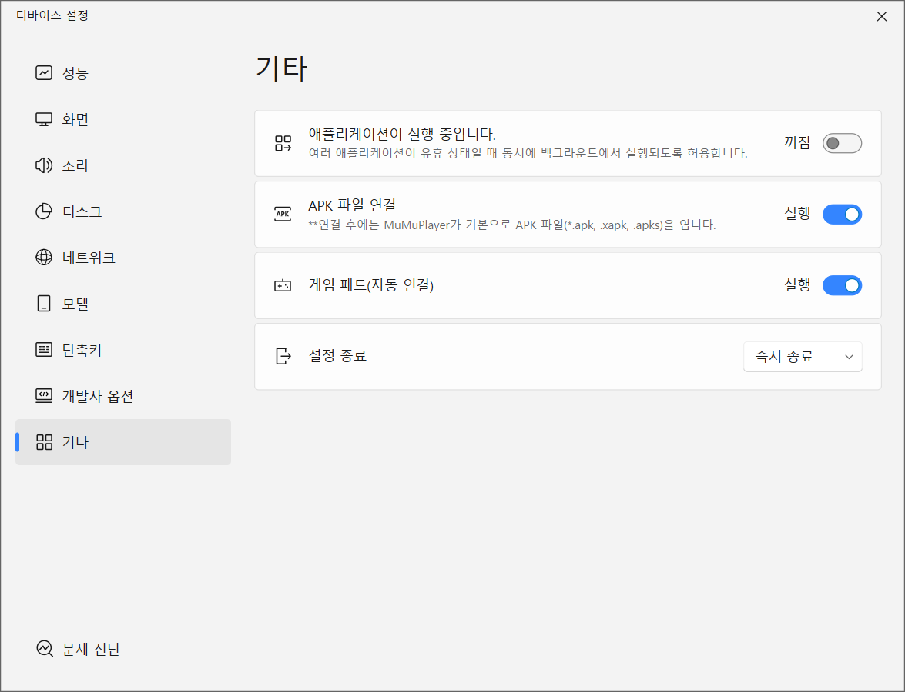
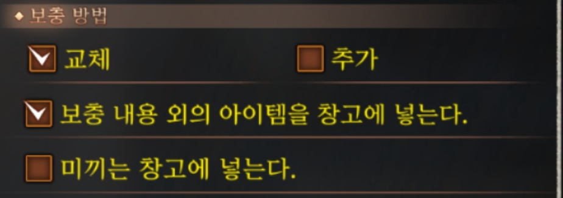
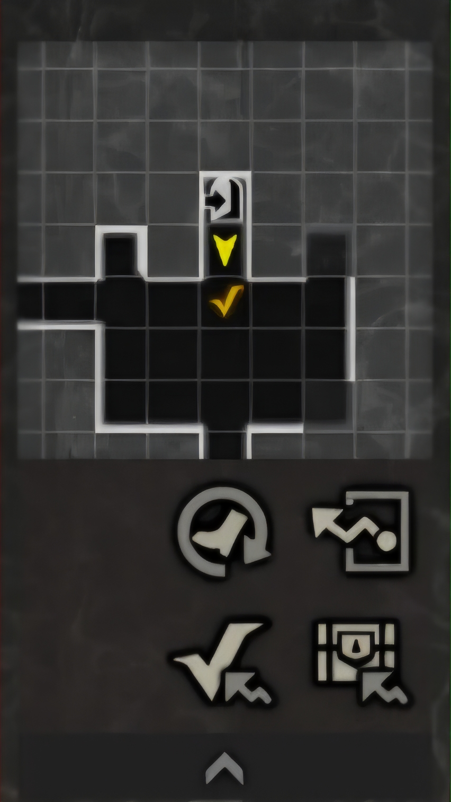

# Wizardry Daphne Kor Macro (위저드리 다프네 한글판 매크로)

> [!IMPORTANT]
> **📌 처음 실행할 때, 그리고 업데이트한 뒤에는 꼭 `처음설정.bat`을 먼저 실행하세요.**
> - **v1.22.0부터는 업데이트할 때 새 버전 파일을 쓰던 폴더에 그냥 덮어씌우기만 하면, 개인 설정값이 망가지지 않고
>   바로 실행할 수 있습니다(최초 1회 설정 필요).** 개인 설정은 이제 `src/main.py`가 아니라 프로젝트 폴더의
>   `my_settings.py`에 저장되고, 업데이트 파일에는 이 파일이 들어 있지 않아서 덮어써도 그대로 남습니다.
> - `처음설정.bat`은 파이썬 → 필수 라이브러리 → ffmpeg → 내 설정 파일을 차례로 자동 검사하고, 안 된 부분만 단계별로
>   알려줍니다. 업데이트로 새 설정이 생기면 `my_settings.py` 끝에 기본값으로 자동 추가하고 목록을 보여줍니다.
> - 처음설정을 안 하고 던전 배치파일을 켜면, 매크로가 게임을 건드리지 않고 "처음설정을 먼저 실행하세요" 안내만 띄우고 멈춥니다.
> - **v1.21.x 이하에서 올라오는 분(최초 1회)**: 예전 설정은 `src/main.py` 안에 있었기 때문에, 같은 폴더에 덮어쓰면 옛 설정이
>   사라집니다. **새 버전을 다른 폴더에 풀고** `처음설정.bat`을 실행한 뒤 "이전 버전 폴더 경로"를 넣으면 옛 설정값을 그대로
>   옮겨 줍니다. 이미 덮어쓰셨다면 `my_settings.py`에서 다시 한 번만 설정해 주세요. 그 다음부터는 덮어쓰기만 하면 됩니다.

> **WizDapKor_v1.22.2 안내** (급한 패치 - 실기 테스트를 제대로 하지 못했습니다)
>
> - 🏠 **힐링 중 힐러방 오인식 패치**: 백아 등에서 힐링 중 힐러방(캐릭터창)을 마을 여관으로 잘못 인식해 같은 자리만 계속 누르던 문제를 고쳤습니다.
> - 🔎 **유령성 던전선택창 인식 오류 패치**: FF XI 콜라보 종료로 던전선택 배경이 바뀌어 '던전선택 불일치'로 세계지도-여관을 반복하던 문제를 고쳤습니다.
> - 💀 **상자 '누가 열 거야?' 창에서 따개(도적) 사망 대응**: 따개가 사망했을 때 사망 카드를 피하고 주인공/생존 캐릭터를 쓰도록 했고, 같은 창이 반복되면 닫고 포기합니다.
> - 🔧 **처음설정의 ffmpeg 설치 확인 개선**: winget 설치 직후에도 ffmpeg를 찾습니다.
>
> ⚠️ **위 수정은 실기 테스트를 제대로 해보지 못한 상태로 올립니다.** 이상이 있으면 이전 버전 폴더로 되돌려 쓰세요.
>
> **업데이트 방법 (기존 매크로를 덮어쓰지 마세요)**
> 1. 새 zip을 **새 폴더**에 풉니다.
> 2. 기존 폴더의 `my_settings.py`만 새 폴더(메인 폴더)에 복사합니다. (선택: `aim_calibration.json`도 복사하면 상자 조준 영점 보정이 이어집니다.)
> 3. 버전이 올라가서 `처음설정.bat`을 한 번 실행해야 시작됩니다. (기존 `my_settings.py`가 있으면 개인 설정을 그대로 씁니다.)
>
> **따개 사망 대응의 한계**: 따개 캐릭터 정보는 **첫 상자를 열 때 따개가 멀쩡한 상태일 때** 저장합니다. 저장 파일은 `aim_calibration.json`과 같은 폴더(매크로 실행 폴더, 메인 폴더)에 `chest_thief_ref.png` / `chest_thief_ref.json`으로 생기며 매크로를 껐다 켜도 유지됩니다. 저장된 정보가 없는 상태에서 첫 상자를 열 때 따개가 이미 사망해 있으면 따개 추적이 제대로 동작하지 않습니다(이 경우 지정 슬롯이 사망이면 주인공 등 생존 캐릭터로 대체). 따개 슬롯 번호 설정을 바꾸면 새로 저장합니다.
>
> **따개를 바꾸셨다면**: 설정의 따개 슬롯 번호를 바꾸면 자동으로 새로 저장하지만, **슬롯 번호는 그대로 두고 그 칸의 캐릭터를 바꾸거나 따개를 다른 캐릭터로 바꾸면 이전 따개를 계속 따라갑니다.** 이때는 매크로를 끈 상태에서 `chest_thief_ref.png`와 `chest_thief_ref.json` 두 파일을 지우고 다시 켜 주세요(첫 상자에서 새 따개가 멀쩡할 때 다시 저장합니다). 이 안내는 다음 버전에서 자동 처리로 바뀌면 삭제할 예정입니다.
>
> **다음 예정**: 사망으로 후열로 밀린 캐릭터를 원래 대열로 되돌리는 **배열 변경(대열 원복) 기능**은 아직 구현되지 않았고, 다음 버전에서 추가할 예정입니다.
>
> **WizDapKor_v1.22.1 안내** (대설지대 귀환 안정화 + 원격 버튼 디자인)
>
> - 🏔️ **마을 외곽에서 멈추던 문제**: 던전을 돌다 마을 외곽 화면이 보이면 스스로 빠져나와 이어갑니다(5분 멈춤 후 재시작 방지).
> - 🗺️ **필드맵에서 하켄(귀환 포탈) 찾기 개선**: 맵 한쪽 구석으로 몬 뒤 뱀 모양으로 전체를 훑어 끝까지 찾습니다.
> - 🗺️ **미니맵 확장 실패 시**: 바로 재시작하지 않고 '나가기'나 하켄으로 돌아갑니다.
> - 📸 **귀환 실패 순간 증거 스크린샷**을 `logs/`에 남깁니다(원인 조사용).
> - 📱 **원격 제어 버튼 디자인**: 버튼 가운데에 큰 반투명 정지/재생 아이콘을 깔고 글씨를 정중앙에 크게 넣었습니다. 원격 서버는 한 번 다시 켜 주세요.
>
> **WizDapKor_v1.22.0 안내** (내 설정 분리 + 상자 예측 조준 + 대설지대 교회구역 안정화)
>
> - 📌 **업데이트 후 꼭 `처음설정.bat`을 한 번 실행하세요**(위 안내 참고). 안 하면 매크로가 시작하지 않고 안내만 띄웁니다.
> - 🎯 **상자 미니게임 예측 조준**(매크로박스님 코드 통합): 막대 속도를 읽고 미리 쏴서 명중률을 올렸습니다. PC마다 다른 지연은
>   초반 몇 판 동안 자동으로 영점을 잡습니다. **ffmpeg가 필요**하며(처음설정이 설치를 도와줍니다), 없으면 예전 연타 방식으로 엽니다.
> - 📦 **상자만 자동 오픈**: `상자 자동오픈(수동플레이용).bat` - 직접 플레이하면서 상자 화면만 매크로에 맡길 수 있습니다.
> - ⛪ **대설지대 교회구역 안정화**
>   - 여관을 들른다고 해 놓고 실제로는 숙박을 안 하던 문제를 고쳤습니다(MP가 바닥나 캐릭터가 죽던 원인).
>   - 힐을 3번 넣어도 빈사가 안 풀리면(MP 부족 등) 제자리에서 힐만 반복하지 않고 마을로 돌아가 쉽니다.
>   - 하켄 메뉴가 떠 있는데 못 알아보고 엉뚱한 곳을 누르던 문제, 필드맵에서 흐릿한 얼룩을 하켄으로 오인하던 문제,
>     맵 끝에서 '자동 이동' 버튼을 못 찾던 문제를 고쳤습니다. 필드맵 제목으로 지금 구역이 맞는지도 확인합니다.
>   - 눈보라 구간에서 '나가기' 후 옆 구역으로 넘어가 버리던 문제를 줄였습니다(눈보라를 벗어나는 즉시 멈춤).
> - 🛑 **같은 실패로 재시작만 반복하면 멈춤**: 진전 없이 5번 연속 재시작하면 뮤뮤 재부팅을 반복하지 않고 멈춥니다(화면은 그대로 둠).
> - ⚡ **시작 속도**: 마지막으로 연결된 뮤뮤 포트부터 붙어 시작이 약 10초 빨라졌습니다.
> - 📱 **원격 제어 화면**: 시작/정지 버튼을 하나로 합쳤습니다(꺼져 있으면 초록 START, 실행 중이면 빨강 STOP - 정지는 두 번 터치).
>   '시작 시 뮤뮤 재시작' 옵션도 추가했습니다. 원격 서버는 새 버전으로 한 번 다시 켜 주세요.
>
> **WizDapKor_v1.21.14 안내** (대설지대 던전 신규 지원 + 화면 인식 속도 개선)
>
> 대설지대를 처음 담은 공개 릴리즈입니다. 큰 변경사항만 정리합니다.
>
> ## 🚨 v1.21.14 긴급 수정 (핫픽스)
> 무인 방치 중 몇 시간씩 멈춰 있던 사고들을 중심으로 고쳤습니다.
> - **앱이 멈춘 화면에서 9시간 방치 완치**: 하켄 귀환 직후 통신 문제 등으로 게임이 멈추면, 모르는 화면으로
>   보고 5분 뒤 앱을 재시작해야 하는데 정체 시간이 계속 초기화돼 재시작이 한 번도 걸리지 않았습니다.
>   이제 약 5분 뒤 정상적으로 앱을 재시작합니다. 켜자마자 기동 복구에 실패한 경우에도 실제로 앱을 재실행합니다.
> - **던전 안에서 마을까지 밀려났을 때 방치 완치**: 뒤로가기가 쌓여 마을까지 밀려나도 던전 처리만 반복하던
>   문제를 고쳤습니다. 마을이 보이면 곧바로 마을 처리로 넘어갑니다.
> - **상자 '열다' 오인식 완치**: 행상인 대화 화면 등을 상자로 잘못 알던 문제를 버튼 위치 한정으로 막았습니다.
> - **상자 캐릭터 선택창("누가 열 거야?") 인식**: 선택창이 실제로 뜬 걸 확인한 뒤 따개 캐릭터를 고르고,
>   매크로가 이 화면에서 시작해도 이어서 처리합니다.
> - **힐링 오터치 방지**: 힐링 중 캠프에 도착하거나 상자 화면이 뜨면 엉뚱한 좌표를 누르지 않고 멈춥니다.
>   힐링 중 상자가 보이면 중단하는 장치도 파일 경로 문제로 꺼져 있던 걸 고쳤습니다.
> - **재시작 속도 개선**: 타이틀의 "Tap to Start"를 바로 누르고, "마스터 데이터 로딩 중"은 끝날 때까지
>   기다립니다. 던전 안 선택지(울타리 구멍 등) 화면에서 재시작돼도 3분 넘게 헛탭하지 않습니다.
> - 📌 **대설지대 사용자 필독**: 게임의 소지품 보충 창에서 `보충한다` 버튼이 비활성 상태면 매크로가 보충을
>   못 합니다. 설정 방법을 그림과 함께 추가했습니다(아래 "게임 내 설정" 3번).
>
> ## 🚨 v1.21.13 긴급 수정 (핫픽스)
> 네 가지를 고쳤습니다.
> - **빈사 정체 무한 반복 완치**: 빈사(딸피) 상태로 화면 인식이 흔들리면 "힐링 1회 → 그래도 안 풀리면
>   나가기"로 넘어가야 하는데, 카운터가 매번 초기화돼 힐링 재시도만 몇 시간씩 반복하다 뒤로가기가 쌓여
>   마을까지 밀려나는 경우가 있었습니다. 이제 정상적으로 나가기 단계로 넘어갑니다.
> - **매크로 중복 실행 방지**: 어떤 경로로든(배치파일을 두 번 누르거나 원격 시작이 겹치는 등) 매크로가
>   두 개 이상 동시에 뜨지 않도록, 나중에 뜬 쪽이 스스로 종료합니다.
> - **힐링 후 오터치 완치**: 미니맵을 접어둔 필드에서 힐링을 마친 뒤, 필드를 못 알아보고 엉뚱한 좌표를
>   누를 수 있던 문제를 고쳤습니다.
> - **새 글꼴의 '재시도'/'타이틀로' 버튼 인식**: 게임 업데이트로 글꼴이 바뀐 오류 팝업 버튼도 인식합니다.
> - 기본 설정 변경: 전투가 끝날 때마다 힐링(`HEALING_LOOPS = 1`).
>
> ## 🚨 v1.21.12 긴급 수정 (핫픽스)
> 세 가지를 추가로 고쳤습니다.
> - **정체 증거 스크린샷 자동 저장**: 매크로가 멈춘 순간의 화면을 자동으로 저장해, 다음에 비슷한
>   문제가 생기면 원인 파악이 훨씬 쉬워집니다.
> - **상자 미니게임 무한 반복 완치**: 뮤뮤 자체가 멈추는 등의 상황에서 상자 미니게임 화면을 두고
>   영원히 왕복하며 방치되던 경우가 있었습니다. 이제 일정 횟수(10회)를 넘으면 진짜 정체로 판단해
>   자동으로 재시작합니다.
> - **"대화창 저격" 오작동 완치**: 매크로 재부팅 직후 특정 선택지 화면(예: 울타리 구멍 조우)을 만나면
>   실제 선택 없이 화살표만 무의미하게 계속 누르며 몇 시간씩 방치되는 경우가 있었습니다. 이제 화살표를
>   누르기 전에 먼저 실제 선택지가 있는지 확인하고, 있으면 올바른 선택지를 고릅니다.
>
> ## 🚨 v1.21.11 긴급 수정 (핫픽스)
> 네 가지 정체 버그를 추가로 고쳤습니다.
> - **던전 진입 대기 시간 상향**: 대설지대 6층 등 일부 던전은 로딩이 10초를 살짝 넘는 경우가 있어,
>   던전 진입 대기 시간을 10초 → 15초로 늘렸습니다.
> - **눈보라구간 재개 버튼 오판정 완치**: 재개 버튼이 비활성 상태인데도 활성으로 잘못 판단해 계속
>   무의미하게 눌리는 경우가 있었습니다. 안개 농도에 따라 화면 밝기 자체가 흔들리는 문제였는데,
>   같은 화면의 "나가기" 버튼 밝기를 기준으로 상대 비교하도록 고쳐 안개 농도와 무관하게 정확히
>   판정하도록 개선했습니다.
> - **정체 탈출 가드 개선**: 정체 상태에서 "빈사" 판정 시 힐을 최대 3회까지 반복 시도하던 것을 1회로
>   줄이고, 그래도 안 풀리면 진짜 빈사가 아닌 것으로 보고 곧장 나가기를 시도하도록 바꿨습니다(모든
>   던전 공통 적용).
> - **부팅 복구 시 전투 화면 오판정 완치**: 동결(freeze) 상태이상이 걸린 전투 화면을 매크로 재부팅
>   직후 인식하지 못해 1시간 넘게 아무 것도 안 하고 방치되는 경우가 있었습니다. 인식 기준을 실전
>   화면으로 재검증해 완치했습니다.
>
> ## 🚨 v1.21.10 긴급 수정 (핫픽스)
> 두 가지 정체 버그를 고쳤습니다.
> - **전투 진입 후 자동전투 미점검 정체**: 전투가 시작되고 배속은 정상 전환되는데, 자동전투 토글
>   버튼의 모양이 최신 UI(전투패턴 번호 배지 추가)와 안 맞아 좌표를 못 찾아 자동전투가 계속 꺼진
>   채 방치되는 경우가 있었습니다. 이제 버튼 위치를 못 찾아도 검증된 고정 좌표로 바로 눌러 켭니다.
> - **대설지대 눈보라구간 재개버튼 무한 반복**: 눈보라 서브구역에서 재개 버튼이 반응 없이 계속 눌리기만
>   하며 무한정 갇히는 경우가 있었습니다. 이제 30초 넘게 안 풀리면 자동으로 나가기를 시도하고, 안전한
>   지점에서 캐릭터를 멈춘 뒤 정상 절차로 복귀합니다.
>
> ## 🚨 v1.21.9 긴급 수정 (핫픽스)
> 파티원이 완전히 사망했는데도 매크로가 이를 "빈사"(HP 낮음, 회복 가능)로 오인해 힐을 무한히
> 재시도하는 버그가 있었습니다. 사망은 힐로 되돌릴 수 없어 이 오판이 계속 반복되며 실제로 **12시간
> 동안 매크로가 헛돌기만 하는 사고**로 이어질 수 있었습니다. 이제 사망을 정확히 구분해, 사망자가
> 확인되면 힐 재시도 대신 마을 회군을 시도합니다(마을 복귀 시 확률적으로 부활하는 경우가 있어
> 시도합니다).
>
> ## 🚨 v1.21.6 긴급 수정 (핫픽스)
> 이전 버전(v1.21.5)에서 주회 횟수(`LIMIT_DUNGEON_LOOPS`)를 **0이 아닌 값**으로 설정하면, 정해진
> 주회를 다 돈 뒤 던전선택 화면에서 무한 루프에 빠지는 버그가 있어 긴급 수정했습니다. 기본값(0,
> 무제한 주회)으로 쓰셨다면 영향이 없었을 것이나, 주회 횟수를 직접 지정해 쓰셨다면 이 버전으로
> 업데이트해주세요.
>
> ## ⚠️ 지원 환경 변경 공지 (v1.20.0부터 적용)
> **MuMu Player 안드로이드 15 인스턴스만 지원합니다.** 안드로이드 12 인스턴스에서는 동작하지 않으며,
> 매크로가 안드15 인스턴스를 찾지 못하면 어느 포트가 안드로이드 몇인지 알려준 뒤 안내를 띄우고
> 중단합니다. (안드12 인스턴스는 그래픽 렌더러 에러가 반복돼 사실상 사용이 불가능해졌습니다.)
>
> ## 🚨 뮤뮤 필수 설정: '앱 상주'를 꺼주세요
> 뮤뮤 **[디바이스 설정] → [기타] → 맨 위 "애플리케이션이 실행 중입니다"** 항목
> (설명이 "여러 애플리케이션이 유휴 상태일 때 동시에 백그라운드에서 실행"인 것)을 **꺼야** 합니다.
> 이게 켜져 있으면 뮤뮤가 앱마다 별도의 화면을 만들어서, 매크로가 **읽는 화면과 클릭하는 화면이 서로
> 달라집니다** — 게임 대신 안드로이드 홈 화면을 마구 누르게 됩니다. 매크로가 시작할 때 이 상태를
> 감지하면 **끄는 방법을 알려주고 즉시 멈춥니다.**
>
> 아래처럼 **"꺼짐"** 상태여야 합니다:
>
> 
>
> - **화면 인식 속도 대폭 향상**: 화면을 읽어오는 방식을 개선해 매크로 전체의 반응 속도가 눈에 띄게
>   빨라졌습니다(캡처 한 번에 평균 1.6초 → 0.6초).
> - **대설지대(Heavysnow) 던전 신규 지원**: 6층 자동 파밍을 지원합니다. 진행 순서는 **상자파밍 →
>   (상자가 떨어지면) 캠핑 → 마을외곽으로 귀환 → 여관은 들르지 않고 아이템만 보충 → 재진입**을
>   계속 반복하는 방식입니다.
> - **던전 안 대화 이벤트 자동 처리**: 이동 중 "수상한 행상인"을 만나면 망치를 구매하고, 중립몹과
>   마주치면 "싸운다"를 선택해 자동으로 넘깁니다. "뼈상인"(뼈 줍는 고블린)을 만나면 **모험가의 뼈를
>   1순위, 유해를 부르는 기름을 2순위**로 구매합니다.
> - **예상 밖 상태 팝업으로 인한 정체 완화**: 상자가 즉시 열리고 곧장 다음 전투로 이어지는 등 드문
>   상황에서 뜬 캐릭터 상태 팝업이 화면 인식을 가려 잠깐 멈추는 현상을, 팝업의 닫기 버튼을 능동적으로
>   눌러 해소하도록 개선했습니다.
>
> ## 🔭 다음 버전 예고
> ~~여전히 자동 스킬 구현은 미루고~~ GUI 기반 글로벌 설정 구역 & 프리셋 배치 편집기를 만들어볼까
> 고민 중입니다. 글로벌 설정이 점점 복잡해지고 있어서, `main.py`를 직접 안 열어도 고칠 수 있는
> 설정 화면이 슬슬 필요해진 상황입니다.
>
> <details>
> <summary>이전 버전(1.19.2) 변경 이력 보기</summary>
>
> **v1.19.2** (대설지대 던전 추가 전 마지막 안정화 릴리즈)
> - **ADB 연결 로그 정리**: 매크로 시작 시 `adb connect`가 포트마다 성공/실패 문구를 줄줄이 찍어 실제
>   오류처럼 보이던 문제를 완치했습니다 - 이제 최종 연결된 인스턴스 번호와 포트만 한 줄로 표시됩니다.
> - **원격 정지 시 콘솔창 잔존 결함 완치**: 부팅 시 시스템 부하로 콘솔 PID 캡처가 1회 실패하면 그대로
>   영구 비활성화되던 걸 재시도(3회)로 보강해, 원격 종료 시 콘솔창이 남는 빈도를 줄였습니다.
> - **스크린샷 동기화 캐시 무한 증식 완치**: 삭제된 원본 스크린샷을 계속 들고 있던 캐시 파일을 정리하도록
>   개선했습니다.
> - **정체 복구 중 사망감지 카운터 리셋 누락 완치**: 정체(stuck) 30초 복구 경로의 사망감지 분기가 화면
>   진행 카운터를 리셋하지 않던 쌍둥이 결함을 완치했습니다.
>
> </details>
>
> <details>
> <summary>이전 버전(1.17.1~1.19.1) 변경 이력 보기</summary>
>
> - **(1.19.1) 재부팅 로그 파일명 결함 완치**: 에뮬레이터 콜드 리부트가 연속으로 여러 번 일어나도 로그
>   파일명이 항상 "reboot1" 아니면 "start"로만 찍히던 결함을 완치했습니다. 유령성 4층 착지 스턱도
>   1회차부터 곧바로 전진 스와이프+출구 재탭을 실행하도록 단축했습니다.
>
> - **(1.19.0) MuMu 멀티 인스턴스(0/1/2번) 자동 감지**: 에뮬레이터 강제 재부팅 시 어떤 뮤뮤 인스턴스를
>   다시 켜야 할지 마지막 접속 포트 기준으로 자동 판단합니다. 재부팅 시 뮤뮤 설정 파일이 프로젝트
>   폴더에 잘못 생성되던 결함도 함께 완치했습니다.
> - **(1.19.0) 원격 정지 시 콘솔창 종료 결함 재완치**: 1.18.0에서 넣은 기능이 매크로 자가 재시작
>   이후엔 다시 무력화되던 구조적 결함(재시작을 거치면 부모 프로세스 추적이 끊김)을 완치했습니다.
> - **(1.19.0) 유령성 4층 상자먹튀파밍 나가기 안정화**: "상자 없음" 토스트를 "경로 없음"으로 오인해
>   불필요한 복구 동작이 나가던 결함을 완치했습니다(착지 스턱 지연 단축은 1.19.1에서 완성).
> - **(1.19.0) 재시작 정책 조정**: 가로화면 인식 실패 시 앱 재시작으로 넘어가는 기준을 30회에서 3회로
>   단축해 과잉 대기 시간을 줄였습니다.
> - 아직 남아있는 알려진 버그(가끔 4층→3층 나가기 대신 3층 상자를 훑고 오는 경우, 톤베리 조우 시
>   자동전투가 그냥 닥돌하는 문제)는 아래 "3. 프리셋 설정"의 상자먹튀파밍 TIP을 참고해주세요.
> - **(1.18.0) 유령성 4층 "상자먹튀파밍" 신규 지원**: 3층에서 하켄으로 진입한 뒤 자동으로 4층까지 들어가
>   상자를 먹고 빠지는 신규 던전 주회가 추가됐습니다.
> - **(1.18.0) 프리셋 선택 방식 변경**: 던전 선택을 `main.py` 편집이 아니라 프로젝트 루트의 던전별
>   `.bat` 파일(`백아1층 파밍.bat`/`유령성2층 채굴.bat`/`유령성4층 상자파밍.bat`) 실행으로 전환.
> - **(1.18.0) 원격 정지 시 콘솔창까지 함께 종료**: 대시보드에서 매크로를 정지하면 이를 띄운 검은
>   콘솔창도 같이 닫히도록 개선(1.19.0에서 재시작 후에도 유지되도록 재완치).
> - **(1.18.0) 던전 필드 정지 시간 단축**: 상자 이동 버튼 더블탭을 단일탭으로 줄이고, 힐/전투/상자 처리
>   직후엔 "재개" 버튼으로 중단된 이동을 즉시 이어가도록 개선.
> - **(1.18.0) 오탐/오작동 다수 완치**: 나가기 도중 하켄 메뉴 미처리, 전투 인식 이진화 불일치로 인한
>   헛도는 재부팅, 정비 후 엉뚱한 버튼 재탭, 전투/상자 카운트 집계 지연으로 힐링이 뜬금없이 발동하던
>   결함 등을 완치.
> - **파이널 판타지 11 콜라보 던전 "북쪽의 유령선" 지원**: 광석 채굴(파밍) 전용 주회 로직이 새로 탑재되어, 상자파밍(백아)과 완전히 다른 회군 규칙(곡괭이 소진 시에만 마을 복귀, 그 외엔 무한 재진입)으로 동작합니다.
> - **원격 시작/정지 지원 (선택 사항)**: 테일스케일 기반의 초경량 원격 제어 서버(`remote_control/`)가 추가되어, 폰 브라우저에서 실시간 로그를 보며 버튼으로 매크로를 시작/정지할 수 있습니다. 설정하지 않으면 비활성 상태로 남는 완전 선택적 기능입니다. 자세한 내용은 아래 "6. 원격 시작/정지" 항목 참고.
> - **(hotfix1) 갱신/공지 팝업 대응 강화**: "타이틀로" 팝업이 마을로 오판정되던 결함과 재시도 팝업 누락을 완치, 해당 팝업 감지 시 매크로를 안전하게 완전 재시작하도록 개선.
> - **(hotfix2) 원격 제어 대시보드 신설**: 시작/정지/상태확인 개별 URL 대신, 실시간 로그와 버튼이 함께 있는 대시보드 웹페이지 하나로 통합. 원격으로 마지막에 시작한 프리셋도 자동으로 기억합니다.
> - **(hotfix3) 원격 제어 백그라운드 실행 지원**: 콘솔 창을 실수로 닫아도 원격 제어가 꺼지지 않도록, 창 없이 백그라운드로 돌아가는 시작/종료 배치파일을 추가했습니다. 대시보드 URL 표시/폴링 관련 결함도 함께 완치했습니다.
> - **(hotfix4) 하켄의 가호 대응 신설**: 하루 한 번(자정 이후) 하켄 귀환 시 뜨는 가호 선택 팝업을 인식하지 못해 매크로가 멈추던 문제를 완치했습니다. 3개 선택지의 등급을 자동으로 비교해 가장 좋은 가호를 선택합니다.
> - **(hotfix5) 하켄의 가호 오탐지 완치**: 하켄 구역 이동 목록 화면을 가호 팝업으로 잘못 인식해 엉뚱한 구역으로 텔레포트하던 결함을 실전 로그로 확인하고 완치했습니다.
> - **(hotfix6) 뮤뮤 완전 동결 시 자가복구 결함 완치**: 뮤뮤가 완전히 멈췄을 때 자가복구 로직 자체가 같이 멈춰버려 매크로가 몇 시간씩 방치되던 문제를 완치했습니다. 이어서 발견된 동결감지 오탐(귀환 직후 잘못된 재시작 폭증), 증거 스크린샷이 빈 이미지로 저장되던 결함, 하켄 앵커 판정 로직까지 함께 개선했습니다.
> - **(hotfix7) 재시작/하켄탈출 복구 결함 완치**: 뮤뮤가 완전히 먹통일 때 재시작 시도 자체가 멈추면 연속 재시작 카운터가 기록되지 않아 에뮬레이터 강제 재부팅으로 승격이 안 되던 결함을 완치했습니다. 하켄 메뉴가 안 열리는 상황에도 계단 탈출과 동일한 백스텝 복구 및 자체 워치독을 적용해 무한 대기 없이 빠르게 자가 복구하도록 개선했습니다.
> - **(hotfix8) 피장막 대응 및 하켄 가호 우선순위 개선**: 주인공이 빈사가 되어 화면에 붉은 피안개가 씌워져도 상자/필드 인식이 계속되도록 완치하고, 빈사 상태를 감지하면 자동으로 힐 시퀀스를 격발하도록 개선했습니다. 하켄 메뉴가 떠 있는 화면에서 매크로를 시작해도 즉시 인식하도록 완치했습니다. 유령성 하켄의 가호에서 "데몬족 헌터"/"오드의 가호"를 색상 등급보다 우선해서 선택하도록 개선했습니다.
> - **(hotfix9) 대용량 다운로드/무한 정체/하켄 기동 인식 결함 완치**: 목요일 콘텐츠 추가 점검 후 대용량(기가바이트급) 리소스 다운로드 도중 기동 복구가 타임아웃되어 에뮬레이터가 강제 리부트되던 결함을 완치했습니다(다운로드 확인 후 20분 유예). 뮤뮤가 완전히 멈춰도 정체 복구 시도 자체가 타이머를 계속 리셋해버려 5분 하드 리밋이 영원히 발동하지 않던 구조적 결함을 완치했습니다. 하켄 메뉴가 떠 있는 화면에서 매크로를 재시작해도 즉시 인식하고 귀환하도록 완치했습니다.
> - **(hotfix10) 유령성 던전선택 버튼 미인식 완치**: 유령성 3회차 엔딩(진엔딩) 이후 던전선택 화면 배경이 바뀌면서 층 이동 버튼 인식이 밤새 실패하던 결함을 완치했습니다(여러 이진화 문턱을 순차 시도하는 방식으로 개선).
>
> </details>

모바일게임 위저드리 배리언트 다프네의 오토파밍 매크로입니다. 현재 백아1층 상자파밍, 유령성 2층 광석파밍,
유령성 4층 상자먹튀파밍 세 가지 던전 주회를 구현해두었습니다.

📝 더 자세한 소개와 사용기는 [블로그 글](https://blog.naver.com/freeman_life/224371225887)에서 확인하실 수 있습니다.

---

## 🌟 핵심 기능
1. **프리셋 기반 자동 던전 주회 및 회군**: 선택한 프리셋에 따라 자동으로 던전을 순회하고, 조건 충족 시 마을로 복귀하여 여관 숙박 정비(레벨업/부활/체력 회복)를 수행합니다.
   - **백아1층 상자파밍**: 지정된 횟수(`LIMIT_DUNGEON_LOOPS`, `0`이면 무한)만큼 주회 후 마을 회군.
   - **유령성2층 광석채굴**: 주회 횟수와 무관하게, 곡괭이가 소진될 때만 마을로 회군하고 그 외엔 무한 재진입.
2. **전투/상자개봉 후 자동정비**: 지정된 전투 횟수 누적 시 혹은 상자 개봉 정산 종료 직후, 자동으로 힐러를 소환해 파티 치료를 수행합니다.
3. **상자 조우 시 자동 해제 - 예측 조준 (매크로박스님의 상자 조준법)**: 함정 해제 미니게임에서 해제 버튼을 무작위로
   연타하던 방식을, **매크로박스님**이 만들어 공유해주신 "막대가 노란 칸 안에 멈출 시각을 예측해 한 번만 누르는"
   조준 방식으로 바꿨습니다. 상자 하나에 최대 2번까지만 누르고, 맞힐 수 없는 판(칸이 너무 좁거나 막대가 너무 빠른 판)은
   누르지 않고 빠져나와 캐릭터 피해를 줄입니다. **ffmpeg 설치가 필요합니다**(아래 "2. 파이썬 환경" 참고).
   - **따개 사망 대응**: 상자 선택창에서 따개(도적)가 사망했으면 사망 카드를 피해 주인공/생존 캐릭터로 엽니다(따개 정보는 첫 상자 때 저장).
   - **상자만 자동 오픈**: 손으로 게임하면서 상자만 매크로에 맡기고 싶을 때 `상자 자동오픈(수동플레이용).bat`을
     실행하세요. 던전 이동/전투는 하지 않고, 화면에 상자 선택지·캐릭터 선택창·미니게임이 뜰 때만 처리합니다.
4. **2중 자가 복구 가드 (Self-Healing)**:
   - 앱/에뮬레이터 프리징 시 프로세스를 강제 종료하고 콜드 리부트(Cold Boot)를 수행합니다.
   - 재기동 시 인게임 점검, 다운로드, 네트워크 오류, 주의 경고창, 기동 공지 팝업, 가로 화면 이상 상태를 무인으로 자동 돌파하여 다시 정상 순회로 이행합니다.
5. **내 설정 + 던전(프리셋)마다 다른 설정**: 개인 설정은 `my_settings.py`에 따로 저장돼 업데이트로 덮어써도 남습니다.
   여기에 더해 `my_settings_<이름>.py`(바꿀 값만 적은 파일)를 만들고 프리셋에 `"settings_profile"`로 연결하면,
   그 배치파일로 켤 때만 다른 값을 씁니다(예: 6층은 무한 주회, 교회구역은 2전투마다 힐링). 자세한 방법은 아래 "4. 내 설정" 참고.

> [!WARNING]
> **현재 지원 범위**
> - 현재 정식 지원 던전 주회는 다섯 가지입니다: **"백아의 동굴"(상자파밍)**, **"북쪽의 유령선" 2층(광석파밍)**,
>   **"북쪽의 유령선" 4층(상자먹튀파밍, FF XI 콜라보 이벤트 던전)**, **"대설지대" 6층(상자파밍)**,
>   **"대설지대" 교회구역(상자파밍)** - 대설지대는 이스벨크 마을외곽을 거쳐 들어갑니다.
> - 전투 중 아군이 사망하면 **역행의 오른손**을 자동으로 연타하고, 주인공이 사망하면 **부활의 불꽃**을 자동으로 사용합니다. 다만 아군이 2인 이상 동시에 사망했을 때 뜨는 선택지 처리는 아직 반영하지 못했습니다. :)
> - **유령성 4층 상자먹튀파밍은 아직 자잘한 버그가 남아있는 상태로 우선 배포합니다.** 그래도 에러 로그가
>   찍히는 것과 무관하게 상자파밍 자체는 계속 이어지니, 로그에 경고/에러가 좀 섞여 나와도 실제로 계속
>   상자를 먹고 있다면 그냥 쓰셔도 무방합니다. 완전히 멈추거나 엉뚱한 곳에서 반복 정체될 때만 로그를
>   첨부해서 문의해주세요.

---

## ⚙️ 1. 에뮬레이터 (MuMu Player) 및 게임 내 설정

> [!IMPORTANT]
> **MuMu Player의 기본 표준 세팅을 변경 없이 그대로 유지해야 합니다.**
> - 매크로의 이미지 템플릿 및 ROI 박스 검출 기준은 **MuMu Player 12의 기본 표준 해상도인 `2560 x 1440` (360 DPI)**을 기준으로 제작되었습니다.
> - 해상도를 임의로 변경할 경우 이미지 매칭 스캔 영역이 찌그러지거나 좌표가 왜곡되어 오탐/오클릭을 격발하게 됩니다.
> - 그래픽 렌더러는 **DirectX** 권장 (Vulkan은 그래픽 드라이버/카드 조합에 따라 렌더링 크래시 위험이 상대적으로 높습니다).

### 에뮬레이터 설정
* **디버그 모드 (ADB) 활성화**:
  - MuMu 플레이어 설정에서 디버깅 모드(ADB)를 항상 허용으로 설정해 주셔야 파이썬이 통신할 수 있습니다.
  - 기본 접속 포트는 통상 `16384` (MuMu 12 기본값)이며, 스크립트 실행 시 3중 포트 자동 스위칭 레이더가 활성화되어 연결을 수립합니다.

### 위저드리 다프네 게임 내 설정
1. **미니맵 배율 기본값 고수**:
   - 던전 내 미니맵과 화면 상태는 반드시 **게임 초기 상태(기본 줌 세팅)** 그대로 유지해야 합니다.
   - 사용자가 인위적으로 미니맵을 줌인(확대) 또는 줌아웃(축소)한 상태일 경우, 맵의 크기나 비율이 달라져 매크로의 이동 제어 및 매칭 엔진이 정상 작동하지 않습니다.
2. **인게임 [설정] (톱니바퀴) 권장 세팅**:
   | 설정 항목 | 권장 세팅값 | 비고 |
   | :--- | :--- | :--- |
   | **화질 설정** | `속도우선` | 프레임 드롭에 의한 탭 씹힘 방지 |
   | **프레임 제한** | `30fps` | CPU 리소스 절약 및 안정적 매칭 |
   | **자동선택** | `OFF` | 대열 꼬임 예방 |
   | **텍스트 일괄 표시** | `ON` | 대화창 연타 돌파 속도 극대화 |
   | **밝기 설정** | `최소` | 이미지 템플릿 색감 매칭의 무결함 유지 |
3. **[소지품 보충] 설정 - 대설지대(6층·교회구역) 사용자 필수**:
   - 대설지대는 귀환할 때마다 마을외곽에서 매크로가 **소지품 보충 창의 `보충한다` 버튼을 눌러** 아이템을 채웁니다.
     이 버튼이 **비활성(흐린) 상태면 눌러도 아무 일도 일어나지 않아**, 보충이 안 된 채 매크로가 버튼만 반복해서
     누르다 막히게 됩니다.
   - 아래처럼 `아이템 개수가 설정되어 있지 않습니다.`라는 빨간 문구가 뜨고 `보충한다`가 흐릿하면 잘못된 상태입니다.

     

   - **보충 방법**에서 `교체`와 `보충 내용 외의 아이템을 창고에 넣는다.`를 체크해 주세요.

     

   - 그러면 아래처럼 `보충한다` 버튼이 **활성화(밝은 상태)**됩니다. 매크로를 돌리기 전에 한 번 직접 열어서
     이 상태인지 확인해 주세요.

     

---

## 💻 2. 파이썬 환경 구축 및 필수 라이브러리 설치

### 파이썬 설치
- Python 3.10 버전 이상의 윈도우용 파이썬을 설치합니다.
- 설치 시 반드시 **[Add python.exe to PATH]** 옵션을 체크하여 환경 변수에 등록해 주세요.

### 필수 라이브러리 설치
윈도우 명령 프롬프트(cmd) 또는 PowerShell을 열고 아래 명령어를 입력하여 필요한 라이브러리를 설치합니다.
```bash
pip install opencv-python pillow numpy pure-python-adb
```

### ffmpeg 설치 (상자 조준 필수)
상자 함정 미니게임의 조준은 움직이는 막대를 1초에 수십 번 읽어야 해서, 화면을 영상으로 받아오는 **ffmpeg**가
필요합니다. **ffmpeg가 없으면 화면을 너무 느리게 읽어서 조준이 거의 누르지 않고 빠져나옵니다**(실측: 없을 때 발사 0회).
1. 윈도우 명령 프롬프트(cmd) 또는 PowerShell에서 아래 한 줄을 입력합니다.
   ```bash
   winget install ffmpeg
   ```
2. 설치가 끝나면 **새로** 연 명령 프롬프트에서 `ffmpeg -version`을 입력해 버전이 나오는지 확인합니다.
3. 원격 제어(6번)를 켜 두셨다면 원격 제어 창을 한 번 껐다 켜 주세요. (매크로는 winget 설치 경로를 직접 찾으므로
   보통은 안 해도 되지만, 확실하게 하려면 재시작을 권장합니다.)

매크로를 켜면 상자 미니게임에 들어갈 때 로그에 ffmpeg 사용 여부가 나오고, 상자만 자동 오픈 실행기는 시작할 때
`ffmpeg: ...` 줄로 바로 알려줍니다. ffmpeg가 없으면 매크로는 조준 대신 예전 연타 방식으로 자동 전환합니다.

### `처음설정.bat` 실행 (필수 - 처음 한 번 + 업데이트할 때마다)
프로젝트 폴더의 **`처음설정.bat`**을 더블클릭하면 아래를 자동으로 검사하고, 안 된 것만 해결 방법을 보여줍니다.
1. **파이썬**: 3.10 이상이 설치되어 있는지(없으면 설치 방법 안내 - "Add python.exe to PATH" 체크 필수).
2. **필수 라이브러리**: 위 `pip install` 목록이 설치되어 있는지(없으면 y 한 번으로 자동 설치).
3. **ffmpeg**: 설치되어 있는지(없으면 y 한 번으로 winget 설치. 설치 동의 질문은 직접 확인).
4. **내 설정 파일 `my_settings.py`**: 없으면 만들고(이전 버전 폴더 경로를 넣으면 옛 설정값을 옮김), 있으면 새로 생긴
   설정만 끝에 추가합니다.

끝나면 요약이 나오고, 그 다음부터 던전 배치파일을 실행하면 됩니다. 이 배치파일은 PC 앞에서 입력하며 진행하는 것이라
원격 대시보드 목록에는 나오지 않습니다.

---

## 🎯 3. 프리셋 설정

> [!IMPORTANT]
> **신버전부터: 던전 선택은 `main.py`를 편집하는 게 아니라, 프로젝트 루트의 `.bat` 파일 중 원하는 걸
> 실행하는 것으로 합니다.** `src/main.py`는 이제 (모든 던전에 공통으로 적용되는) **글로벌 설정값만
> 편집하는 곳**이고, `ACTIVE_PRESET_NAME`을 직접 고치거나 프리셋 줄을 손으로 전환하는 건 더 이상
> 권장하지 않습니다.

던전마다 필요한 마을/층/파밍방식 조합은 이미 다 세팅되어 있고, 프로젝트 루트에 던전별 배치파일이 하나씩 있습니다:

| 배치파일 | 던전 주회 |
| :--- | :--- |
| `백아1층 파밍.bat` | 백아의 동굴 1층 (상자파밍) |
| `유령성2층 채굴.bat` | 북쪽의 유령선 2층 (광석파밍) |
| `유령성4층 상자파밍.bat` | 북쪽의 유령선 4층 (상자먹튀파밍) |

원하는 던전의 배치파일을 더블클릭하면 그 프리셋으로 바로 시작됩니다(원격 대시보드에서도 동일하게 선택 가능 - 아래 "6. 원격 시작/정지" 참고). 새로운 던전 조합이 필요하시면 `src/presets.json`에 프리셋을 추가할 수 있지만, 해당 마을/던전에 대한 이미지 템플릿과 코드 연동이 먼저 되어 있어야 하니 AI 코딩 어시스턴트에게 요청하시는 걸 권장합니다.

> [!TIP]
> **광석파밍("유령성 2층 채굴") 실전 팁**
> - **(필수) 2층/4층/5층 각각, 하켄 바로 앞에 있는 채굴 장소에 체크포인트를 미리 찍어두셔야 합니다.** 체크포인트가 없으면 매크로의 하켄 귀환/재진입 루프가 정상 작동하지 않습니다.
> - **마을이 아니라 던전선택 화면에서 매크로를 시작하는 것을 권장합니다.** 곡괭이를 인벤토리에 충분히 채워둔 뒤 유령성 던전선택 화면에서 시작해 주세요. 마을에서 시작하면 매크로가 곧바로 여관 숙박부터 진행하는데, 이 과정의 "소지품 정리" 단계에서 인벤토리의 황금 곡괭이가 창고로 들어가버릴 수 있습니다.
> - **노던할로우 마을**의 "소지품 정리" 옵션에서 **북방의 곡괭이 자동 채우기**를 설정해두면, 들고 있던 곡괭이를 전부 소진했을 때 자동으로 북방의 곡괭이로 채굴을 이어갑니다. 다만 창고에 북방의 곡괭이가 없을 때 자동으로 상점에서 구매가 안 되는 버그가 있으니, 미리 창고에 충분한 양의 북방의 곡괭이를 구매해두시는 걸 추천드립니다. (수정 공지는 올라왔지만 직접 확인은 못 해봤습니다.)

> [!TIP]
> **상자먹튀파밍("유령성 4층 상자파밍") 실전 팁**
> - 이 프리셋은 **3층에서 하켄으로 진입한 뒤, 체크포인트 이동과 스와이프 조작으로 자동으로 4층까지
>   들어가는 구조**입니다 - 던전선택 화면에서 4층 버튼을 직접 누르는 게 아니라, 3층 진입 후 매크로가
>   알아서 4층으로 넘어갑니다.
> - **(필수) 게임 내부 버그로 인해 3층에서 4층 입구까지 한 번에 자동이동이 안 됩니다.** 그래서 4층
>   입구에서 **아래로 두 칸 떨어진 자리**(입구 바로 아래 칸이 아니라, 그 아래 한 칸 더)에 미리
>   체크포인트를 찍어두셔야 합니다. 아래 스크린샷(`readme_img/유령성3층셋팅.png`)을 참고해
>   동일한 위치에 체크포인트를 찍어주세요.
>
>   
> - **던전 안(3층 필드 등)에서 매크로를 시작하지 마시고, 될 수 있으면 유령성 던전선택 화면에서
>   시작해주세요.** 던전 안에서 시작하면 위 3층→4층 진입 시퀀스를 거치지 않고 곧바로 그 자리에서
>   상자파밍부터 시작해버립니다.
> - **⚠️ 톤베리 조우 시 사망 각오하고 사용하세요.** 아직 몹별 캐릭터 스킬 자동 사용(톤베리 대응 포함)이
>   구현되어 있지 않아, 톤베리를 만나면 자동전투가 회피/원거리 유지 없이 그냥 닥돌(근접 돌진)해버려
>   파티원이 사망할 수 있습니다(제보: 실제로 밤새 돌려보니 일부 캐릭터 멘탈이 박살나 있었음). 소중한
>   캐릭터라면 이 프리셋 사용을 신중히 결정해주세요. (여담: 제작자는 전사 라인 캐릭터에도 그냥
>   에클라 보우를 들려서 원거리로 돌려버려서 이 문제를 딱히 안 느끼고 있어, 스킬 자동화 개발 우선순위가
>   낮은 상태입니다 ㅋㅋㅋ)
> - **⚠️ 가끔 나가기가 삑나서, 4층 상자를 다 털고 3층으로 내려온 뒤 던전 밖으로 안 나가고 3층 상자를
>   또 훑고 오는 경우가 있습니다.** 원인 미확정인 알려진 버그입니다. 위험하진 않고(그냥 3층 상자도
>   먹고 옴) 파밍 시간만 조금 늘어나는 정도이니, 참고만 해주세요.
> - 아직 자잘한 버그가 남아있는 초기 배포 버전입니다 - 로그에 경고/에러가 섞여 나와도 실제로 상자를
>   계속 먹고 있다면 그냥 쓰셔도 됩니다.

---

## 🛠️ 4. 내 설정 (`my_settings.py`)

개인 설정은 프로젝트 폴더의 **`my_settings.py`**에서 고칩니다(`처음설정.bat`이 만들어 줍니다). 노트패드++ 등으로 열어
`이름 = 값` 부분의 값만 바꾸고 저장하면, 다음에 매크로를 켤 때 적용됩니다.
- **업데이트해도 이 파일은 바뀌지 않습니다.** `src/main.py` 맨 위의 같은 이름 값은 "기본값"일 뿐이라 거기를 고쳐도
  `my_settings.py` 값이 우선합니다.
- 이 파일은 **어떤 던전 프리셋을 쓰든 공통으로 적용되는 값**입니다. 던전 자체를 바꾸는 건 위 "3. 프리셋 설정"의 `.bat` 선택으로 합니다.
- 매크로를 켜면 로그 맨 위에 `🧩 [내 설정] 적용 순서: main.py 기본값 -> my_settings.py(바꾼 값 N개)`처럼 실제로 적용된 내용이 나옵니다.

| 변수명 | 기본값 | 상세 설명 |
| :--- | :---: | :--- |
| **`LIMIT_DUNGEON_LOOPS`** | `2` | 상자파밍 전용: 던전을 몇 바퀴 주회하고 마을(여관)로 회군할지 설정합니다. `0`이면 무한 주회. (광석파밍은 이 값과 무관하게 곡괭이 소진 시에만 회군) |
| **`START_RUN_COUNT_OFFSET`** | `1` | 최초 실행 시 시작할 오프셋 카운트입니다. |
| **`ENABLE_FIRST_COMBAT_SKILL`** | `0` | 첫 전투 시 숏컷 기반 광역 스킬 예약을 사용할지 설정합니다. (⚠️ 현재 미구현으로 무조건 `0` 고정) |
| **`ENABLE_HEAL_AFTER_CHEST`** | `0` | 상자 개방 성공 후 긴급 파티 치료(정비)를 작동할지 설정합니다. (`0`: Off / `1`: On) |
| **`HEALING_LOOPS`** | `1` | 몇 회의 전투마다 파티 힐링 정비를 수행할지 설정합니다.<br>- `1`: 매 전투 종료 시 필드 복귀 직후 즉시 힐링 실행<br>- `2`: 2회 전투 치를 때마다 힐링 실행<br>- `0`: 자동 힐링 정비 비활성화 |
| **`HEALER_SLOT`** | `5` | 1번~6번 슬롯 중 주 힐러(스켈톤 등)의 배치 슬롯 번호입니다. |
| **`MASKED_ADVENTURER_SLOT`** | `6` | 1번~6번 슬롯 중 주인공 캐릭터의 배치 슬롯 번호입니다. |
| **`CHEST_OPENER_SLOT`** | `6` | 1번~6번 슬롯 중 상자 따기(함정 해제)를 담당할 캐릭터 슬롯 번호입니다. |
| **`CHEST_AIM_CALIBRATION`** | `"auto"` | 상자 조준 영점 보정 방식입니다(아래 설명 참고).<br>- `"auto"`: 쏠 때마다 실측해 10발부터 내 PC에 자동으로 맞춤(권장)<br>- `"macrobox"`: 매크로박스님 PC 값 고정(빠른 PC)<br>- `"lowspec"`: 저사양 PC 값 고정<br>- `"manual"`: 아래 세 값을 직접 입력<br>- `"none"`: 조준 끔 - 예전처럼 해제 버튼을 연타(횟수 제한 없음, ffmpeg 불필요). 따개 스펙이 높아 노란 칸이 넓다면 이쪽이 더 나을 수 있습니다 |
| **`CHEST_AIM_PRESERVE_MENTAL`** | `1` | 상자 미니게임을 실패했을 때 어디까지 도전할지 정합니다. 게임 규칙상 기회는 기본 3번(도적 만렙 4번)이고, 실패할 때마다 멘탈 -1, **기회를 모두 실패하면 추가로 멘탈 -5**입니다.<br>- `1`(기본, 멘탈 보존): 상자당 2번 실패하면 포기해 "전부 실패 -5"를 피합니다(매크로박스님 설정)<br>- `0`(끝까지 연다): 멘탈이 깎여도 상자를 엽니다. 횟수 제한 없이 미니게임이 보이는 한 계속 도전하고, 조준할 틈이 안 나는 판도 포기하지 않고 마지막엔 누릅니다 |
| **`CHEST_AIM_MANUAL_GLIDE_PX`**<br>**`CHEST_AIM_MANUAL_LATENCY_MS`**<br>**`CHEST_AIM_MANUAL_JITTER_MS`** | `86.0`<br>`184.0`<br>`28.0` | `"manual"`일 때만 쓰입니다. 탭 후 막대가 더 미끄러지는 거리 = `GLIDE + LATENCY x 막대속도`, JITTER가 클수록 애매한 판에서 안 누릅니다. |
| **`ENABLE_EMULATOR_REBOOT`** | `True` | 디바이스 오프라인 또는 정체 지속 시 에뮬레이터를 강제 재시작할지 설정합니다. |
| **`MUMU_EXECUTABLE_PATH`** | *(경로)* | 에뮬레이터 자동 재부팅을 위해 본인 PC 환경에 맞는 MuMu Player의 실행 파일(`nx_main\MuMuNxMain.exe`) 절대 경로를 입력합니다. |
| **`MUMU_VM_INDEX`** | `"0"` | 아직 ADB 연결에 한 번도 성공하지 못한 상태(예: 최초 부팅 직후 바로 콜드 리부트)에서만 쓰이는 비상용 폴백입니다. 평소엔 마지막으로 실제 연결됐던 포트를 보고 MuMu 인스턴스 번호(0/1/2)를 자동으로 판별하므로, 직접 수정할 필요가 거의 없습니다. |

> [!NOTE]
> **상자 조준 영점 보정이란?** 탭을 누른 뒤 실제로 게임에 반영되기까지 PC마다 지연이 달라서, 막대가 "누른 뒤 얼마나
> 더 미끄러지는지"가 PC마다 다릅니다(실측: 매크로박스님 PC와 제 PC가 평균 177px 차이 - 제 PC에서 매크로박스님 값을 그대로
> 쓰면 빠른 막대는 거의 다 빗나갔습니다). 기본값 `"auto"`는 매 발마다 로그에 `📏 활공 실측`(예측 vs 실제로 미끄러진 거리)을
> 찍고, 그 값을 프로젝트 폴더의 `aim_calibration.json`에 모아 **10발부터 내 PC 값으로 자동 보정**합니다
> (`🎯 [상자 조준 영점] 자동 보정 갱신` 로그). **처음 몇 판은 PC에 따라 빗나가거나 안 누르고 빠지는 일이 있을 수
> 있지만, 데이터가 쌓이면 그때부터 자동으로 보정에 들어갑니다.** 보정은 매크로를 켜 둔 채로 **그 자리에서 바로**
> 적용되고(재시작 불필요), 모은 데이터는 파일에 남아 다음에 켤 때도 보정된 값으로 시작합니다. 처음 10발은
> 매크로박스님 값을 쓰므로, 저사양 PC라면 처음부터 `"lowspec"`으로 두셨다가 나중에 `"auto"`로 바꾸셔도 됩니다. **PC를 바꾸거나 뮤뮤 설정을 크게 바꾸면
> `aim_calibration.json`을 지워서** 처음부터 다시 모으게 하세요.

> [!TIP]
> **던전마다 다른 설정 쓰기 (프리셋별 프로필)**: 예를 들어 6층에서는 무한 주회, 교회구역에서는 힐링을 2전투마다 하고 싶다면
> 1. 프로젝트 폴더에 `my_settings_6층.py`처럼 **바꾸고 싶은 값만** 적은 파일을 만듭니다(예: `LIMIT_DUNGEON_LOOPS = 0` 한 줄).
> 2. `src/presets.json`의 해당 프리셋에 `"settings_profile": "6층"`을 추가합니다.
>
> 그러면 그 배치파일로 켤 때만 `main.py 기본값 -> my_settings.py -> my_settings_6층.py` 순서로 덮어써서 적용됩니다.
> 같은 던전을 설정만 바꿔 여러 벌 쓰고 싶으면, 프리셋을 하나 더 만들어 다른 프로필을 가리키게 하면 됩니다. 프로필 파일도 업데이트로 덮이지 않습니다.

> [!NOTE]
> `ACTIVE_PRESET_NAME`/`TOWN_NAME`/`DUNGEON_NAME`/`DUNGEON_FLOOR_NAME`/`FARMING_METHOD`도 코드에 보이지만, 이는 **`.bat` 파일 없이 `python src/main.py`를 직접 실행할 때만 쓰이는 비상용 로컬 폴백**이라 직접 수정할 필요가 없습니다. 던전 선택은 항상 위 "3. 프리셋 설정"에 안내된 `.bat` 파일로 하세요.

> [!NOTE]
> **MuMu 멀티 인스턴스 자동 감지 관련 안내**: 콜드 리부트(에뮬레이터 완전 재시작) 시 MuMu의 어느
> 인스턴스(#0/#1/#2)를 켤지는 이제 자동으로 판별합니다. 다만 **#0과 #2 인스턴스의 실제 포트만 직접
> 확인했고, #1은 확인하지 못했습니다**(공식으로 역산한 추정값만 코드에 들어있습니다). **혹시 MuMu에서
> #1 인스턴스를 사용 중이신 분은, 콜드 리부트가 정상적으로 #1을 재실행하는지 한 번 확인해보시고 결과를
> 알려주시면 감사하겠습니다.** (제보는 [블로그](https://blog.naver.com/freeman_life/224371225887) 댓글로 남겨주세요.)

---

## 🚀 5. 매크로 실행 및 관리

### 실행 방법
1. 위 "3. 프리셋 설정"의 표에서 원하는 던전에 해당하는 `.bat` 파일을 확인합니다.
2. 프리셋에 맞춰 게임을 아래 상태로 미리 세팅해두고 매크로를 시작하는 것을 권장합니다. (MuMu가 꺼져 있어도 매크로가 자동으로 실행하고 로그인까지 복구를 시도하지만, 아래 상태에서 시작해야 파밍이 바로 정상 진행됩니다.)
   - **상자파밍(백아 등)**: 미리 쓰고 싶은 스킬을 다 사용해두고 자동전투 모드만 켠 채로, 전투 가능한 상태에서 시작하세요.
   - **광석파밍(유령성 2층 등)**: 곡괭이를 인벤토리에 충분히 채워두고, 마을이 아니라 유령성 던전선택 화면에서 시작하세요. (이유는 위 "광석파밍 실전 팁" 참고)
   - **상자먹튀파밍(유령성 4층)**: 3층 진입 지점부터 시작하세요. 체크포인트를 미리 찍어두셔야 합니다(위 "상자먹튀파밍 실전 팁" 참고).
3. 해당 `.bat` 파일(예: `유령성2층 채굴.bat`)을 더블클릭하면 자동으로 에뮬레이터를 찾아 통신을 연결하고 주행을 개시합니다.
4. **손으로 플레이하면서 상자만 자동으로 열고 싶을 때**는 `상자 자동오픈(수동플레이용).bat`을 실행하세요(매크로 본체와
   동시에 켤 수는 없습니다). 원격 대시보드 목록에도 나타나므로, 매크로를 원격으로 정지한 뒤 상자 앞에서 이걸 켜는 식으로도
   쓸 수 있습니다. 로그는 `logs/<시각>_chestonly.txt`에 남습니다.

### 로그 관리
* **자동 디스크 청소기**:
  - 매크로를 실행하면 `logs/` 디렉토리에 실행 이력에 대한 상세 텍스트 로그 파일이 생성되고 백업됩니다.
  - 디스크 공간 절약을 위해 매크로 기동 시 **4일이 경과한 오래된 로그 및 이미지 파일들은 자동으로 영구 삭제** 처리됩니다.

### 에러 발생 시 대처법
- 매크로 오작동 또는 에러가 발생하여 멈추는 경우, 에러가 발생한 당시의 에뮬레이터 화면을 캡처하고, `logs` 폴더의 최신 로그 텍스트 파일 내용을 함께 첨부하여 AI 코딩 어시스턴트(Claude Code 등)에 문의하시면 개인 환경에 맞게 수정을 지원받으실 수 있습니다.
- 버그 제보나 문의는 [블로그](https://blog.naver.com/freeman_life/224371225887) 댓글로 남겨주셔도 됩니다.

---

## 📱 6. 원격 시작/정지 (선택 사항)

`remote_control/` 폴더는 폰 브라우저 북마크(홈 화면 아이콘) 탭 한 번으로 PC의 매크로를 원격으로 시작/정지할 수 있게 해주는 **완전히 선택적인 보조 도구**입니다.

### 왜 이 기능을 만들었나
매크로가 던전을 도는 중에 같은 게임 계정으로 폰에서 접속하면, MuMu 쪽 위저드리 세션이 "다른 곳에서 로그인됨"으로 강제 종료됩니다. 그런데 매크로는 이 상황을 "게임이 튕겼다"로 인식하고 **자동으로 재접속을 시도**하는데, 이게 다시 폰 쪽 세션을 끊어버립니다. 결과적으로 폰 접속 ↔ 매크로 자동 재접속이 서로 계속 끊어먹는 악순환이 발생합니다.

그래서 만든 개인적인 용도의 기능입니다: **외출 중 폰으로 직접 플레이하고 싶을 때 → 원격으로 매크로를 잠깐 정지 → 폰으로 즐기기 → 다 끝나면 다시 원격으로 매크로 시작.**

### 보안 관련 안내
- **개발자(저)가 사용자 PC에 접속하는 기능이 전혀 아닙니다.** 이 폴더는 PC 안에서만 동작하는 로컬 서버 스크립트이고, 개발자 서버로 어떤 데이터도 전송되지 않습니다.
- 사용자의 개인정보(계정, 위치, 사용 기록 등)를 수집하거나 활용하는 코드는 전혀 없습니다.
- **직접 설정(테일스케일 설치 + `Start Remote Control.bat` 실행 + 배치파일 경로 입력)하지 않으면 이 기능 자체가 활성화되지 않습니다.** 아무 설정도 안 하면 그냥 없는 기능이나 마찬가지입니다.
- 찜찜하시면 `remote_control/` 폴더를 통째로 지우셔도 됩니다. **매크로 본체(`src/main.py`)는 이 폴더의 존재 여부와 무관하게 정상 동작합니다.**

### 설정 방법
1. PC와 폰에 [Tailscale](https://tailscale.com) 설치 후 같은 계정으로 로그인 (사설 네트워크로 폰-PC를 안전하게 연결, 포트를 인터넷에 노출하지 않습니다).
2. `remote_control/Start Remote Control.bat`를 더블클릭합니다. 프로젝트 루트 폴더에 있는 `.bat` 파일들(예: `유령성2층 채굴.bat`)을 자동으로 찾아 시작 대상으로 등록하므로, 별도 설정 파일을 편집할 필요가 없습니다.
3. 콘솔 화면(그리고 `remote_control/설정안내.txt`)에 **대시보드 URL**이 출력됩니다. (프리셋별로 배치파일을 여러 개 만들어두시면, 대시보드의 시작 드롭다운에 그만큼 자동으로 선택지가 늘어납니다.)
4. 스마트폰의 웹 브라우저에서 그 대시보드 URL을 열고 **"홈 화면에 추가"**로 등록하면, 이후로는 아이콘 탭 한 번으로 원격 제어가 가능합니다.
5. 정상 접속까지 확인되셨다면, 그 다음부터는 `Start Remote Control.bat` 대신 **`Start Remote Control (Background).bat`**를 사용하시는 걸 권장합니다. 창이 아예 뜨지 않고 조용히 백그라운드에서 돌아가기 때문에, 실수로 콘솔 창을 닫아서 원격 제어가 꺼지는 사고를 방지할 수 있습니다. 끌 때는 `Stop Remote Control (Background).bat`를 실행하시면 됩니다.

> [!TIP]
> 처음 설정하실 때는 URL을 눈으로 확인해야 하니 **일반 버전(`Start Remote Control.bat`)으로 먼저 시작**해서 북마크까지 등록하시고, 그 다음부터 평소에는 **백그라운드 버전**을 쓰시는 순서를 권장합니다.

### 대시보드 화면
북마크를 열면 실시간 로그(5초마다 자동 갱신, 화면을 벗어나면 자동 일시정지)와 상태 표시가 상단에 보이고, 그 아래 프리셋 드롭다운 + 시작/정지 버튼이 있습니다. 별도로 "상태확인" 버튼을 누를 필요 없이, 로그가 갱신되는 것 자체로 매크로가 살아있는지 바로 알 수 있습니다.

프리셋별로 배치파일을 여러 개 등록해두신 경우, **드롭다운은 원격으로 마지막에 실제로 시작했던 배치를 기억해서 자동으로 미리 선택해둡니다** (예: 지난번에 원격으로 "유령성 2층 채굴"을 시작하셨다면, 다음에 대시보드를 열어도 그게 그대로 선택되어 있습니다). 단, PC에서 배치파일을 직접 더블클릭해서 켠 경우는 대상이 아니며, 오직 원격(대시보드/URL)으로 시작한 기록만 반영됩니다.

개별 URL(`/start`, `/stop`, `/status`)도 그대로 남아있어서, 대시보드 대신 예전 방식으로 북마크하셔도 됩니다.
5. 평소엔 폰의 Tailscale을 꺼두셔도 됩니다 — 원격으로 조작하고 싶을 때만 잠깐 켜시면 됩니다. (다른 로컬 VPN 기반 앱을 쓰고 계시다면, 안드로이드 특성상 VPN은 동시에 하나만 활성화되니 참고해 주세요.)

---

## 🙏 기여 (Acknowledgements)
- **매크로박스님** - 상자 함정 미니게임의 **예측 조준 방식**(노란 칸·막대 속도 측정, 탭 지연 보정, ffmpeg 영상 스트림,
  상자당 2발 제한과 "애매하면 안 누르기" 설계)을 직접 만들어 공유해 주셨습니다. 이 매크로의 상자 해제는 그 코드를
  거의 그대로 통합한 것이고, PC별 영점 자동 보정만 덧붙였습니다. 감사합니다!

---

## ⚖️ 책임 한계 고지
본 매크로 프로그램을 사용하는 모든 책임은 사용자 본인(매크로 사용자)에게 있습니다. 비정상적인 이용으로 인한 불이익이나 계정 제재 등의 모든 책임은 사용자에게 귀속됩니다.
