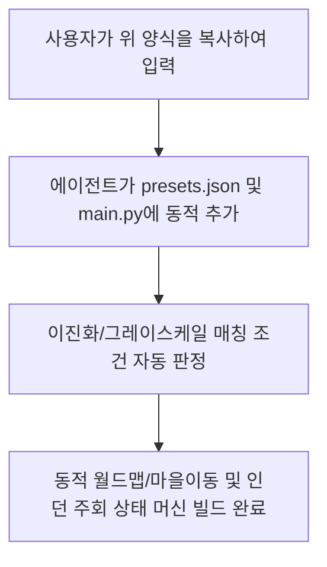

# 🪜 신규 던전 추가 요청 템플릿 (v1.17.0+)

앞으로 새로운 던전을 매크로에 연동하거나 추가하고 싶으실 때, 아래 양식을 채워서 대화창에 제공해 주시면 추가적인 설명 논의 없이 즉시 기동 로직과 월드맵 분기, 층 매칭 코드를 최단 시간에 무결하게 빌드 및 자동 생성해 드립니다.

---

## 📋 신규 던전 설정 양식 (복사용)

```markdown
1. 던전명 (한글): 이스벨크 대설지대 6층
2. 던전 영문 식별키 (도장명 접두어): Heavysnow_4F, Heavysnow_6F, Heavysnow_church
3. 기동 방식 (1: 월드맵 바로 진입, 2: 마을 경유 진입): 2

[3번이 1번(월드맵 바로 진입)인 경우]
- 진입할 던전 월드맵 아이콘 파일명: [예: Worldmap/fire_den.png]
- 던전 셀렉창 확인 앵커 파일명: [예: fire_den_Anchor.png]

[3번이 2번(마을 경유)인 경우]
- 출발할 마을명 (한글): 이스벨크
- 출발할 마을 식별키: Vill_Isbelg, 발음은 이스벨크인데 isbelg인지 isbelk인지 헷갈림 어떤게 맞다고 생각해? 일단 이건 의견제시하고 진행하자 파일/폴더명도 하나로 통일할거야
- 마을 외곽 버튼 도장 파일명: Worldmap\Vill_isbelk_btn.png
- 마을 내 여관 버튼 도장 파일명: - 이거 지금 공용도장이지? 그러니 앞으론 패스
- 외곽 이동 후 클릭할 던전 선택 아이콘 파일명: templates\Vill_Isbelg\dungeon_Heavysnow.png 좌표(919, 1369)~(1170, 1450)

4. 진입할 목표 층계 목록: 4층, 6층, 교회구역
- 층 선택 도장 파일명 리스트 (반투명 여부 명시): Heavysnow_4F.png, Heavysnow_6F.png, Heavysnow_church.png
- 각 층마다 적용할 주회방법 (상자파밍 / 광석파밍 / 단순전투):
  - 4층: 체크포인트 이동(이건 자세한 설명과 커스텀이 필요함)
  - 6층: 상자파밍
  - 교회구역: 상자파밍
5. 주회 로직 세부 정보 (광석 파밍 등 특수 파밍 시만 입력)
 - 4층: 추후 기입하겟음
 - 6층 상자 없으면 복귀버튼이 아니라 미니맵을 눌러서(1204 202 ~ 1231 237) 전체맵으로 키우고, 맵을 왼쪽 위로 올리고 스와이프하면서(월드맵처럼) 캠프 아이콘을 감지하면 아이콘(Fieldmap_camping)을 터치, 터치 후 터치한곳 살짝 윗쪽에 "자동이동"버튼 나오는데(이거아직캡쳐못함) 그거 눌러서 캠프로 이동, 캠프 도착하면 대화창열리는데 여기서 "쉰다" 다음대화창도 "쉰다" (곧캡쳐할께)해서 hp/mp회복=여관불필요, 이후 나가기버튼 누르면 하켄으로 자동이동하고 하켄활성화되면 귀환(이거 귀환 어제 매크로 켜보니까 밝기랑 배경이 달라서 그런지 매크로에서 인식못하는듯? C:\Users\KONURI\Wiz_Daphne_with_Antigravity\dev\ROI_check\이스벨크-6층\6 6층 하켄활성.png 이거에서 귀환을 인식못하더라), 이러면 다시 마을외곽으로 나오는데 여기서 나가서 여관가는게 아니라 재정비버튼(추후 추가예정 아직 캡쳐못함)을 누르고 확인하면 인벤에 있는 쓸모없는 잡템들 정리됨. 그러면 다시 주회시작하면 됨. 끝날때 캠핑하면 hp/mp/상태이상 다 초기화되니까 여관 갈 필요가 없음 
 - 교회구역: 상자 없으면 미니맵 눌러서 맵 확장시키고 대하캔(아직 아이콘 도장 못따옴) 눌러서 그 위에 자동이동(못따옴)눌러서 복귀, 

---

## 💡 템플릿 적용 흐름도 (Workflow)


