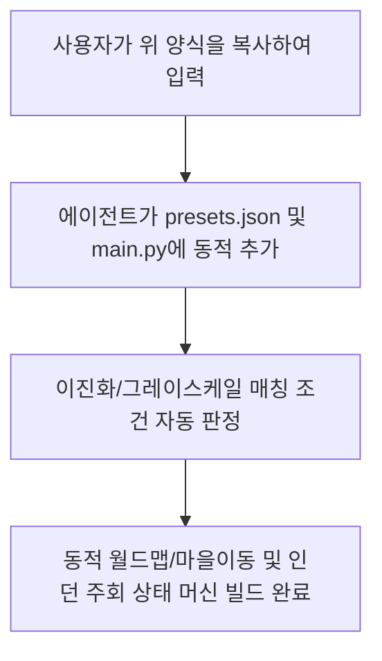

# 🪜 신규 던전 추가 요청 템플릿 (v1.17.0+)

앞으로 새로운 던전을 매크로에 연동하거나 추가하고 싶으실 때, 아래 양식을 채워서 대화창에 제공해 주시면 추가적인 설명 논의 없이 즉시 기동 로직과 월드맵 분기, 층 매칭 코드를 최단 시간에 무결하게 빌드 및 자동 생성해 드립니다.

---

## 📋 신규 던전 설정 양식 (복사용)

```markdown
1. 던전명 (한글): [예: 불의 마굴]
2. 던전 영문 식별키 (도장명 접두어): [예: fire_den]
3. 기동 방식 (1: 월드맵 바로 진입, 2: 마을 경유 진입): [예: 2]

[3번이 1번(월드맵 바로 진입)인 경우]
- 진입할 던전 월드맵 아이콘 파일명: [예: Worldmap/fire_den.png]
- 던전 셀렉창 확인 앵커 파일명: [예: fire_den_Anchor.png]

[3번이 2번(마을 경유)인 경우]
- 출발할 마을명 (한글): [예: 루크나리아]
- 출발할 마을 식별키: [예: luknalia]
- 마을 외곽 버튼 도장 파일명: [예: EdgeOfTown/luknalia.png]
- 마을 내 여관 버튼 도장 파일명: [예: Luknalia/inn.png]
- 외곽 이동 후 클릭할 던전 선택 아이콘 파일명: [예: Luknalia/fire_den_select.png]

4. 진입할 목표 층계 목록: [예: 1층, 2층, 3층]
- 층 선택 도장 파일명 리스트 (반투명 여부 명시): [예: 1st.png (반투명), 2nd.png (반투명)]
- 각 층마다 적용할 주회방법 (상자파밍 / 광석파밍 / 단순전투):
  - 1층: [예: 상자파밍]
  - 2층: [예: 광석파밍]

5. 주회 로직 세부 정보 (광석 파밍 등 특수 파밍 시만 입력)
- 1) 광석 감지 대기 도장 파일명 (diggable.png 등):
- 2) 광석 채굴 완료 도장 파일명 (nothingToDig.png 등):
- 3) 곡괭이 부족 경고 도장 파일명 (needpickaxe.png 등):
```

---

## 💡 템플릿 적용 흐름도 (Workflow)


